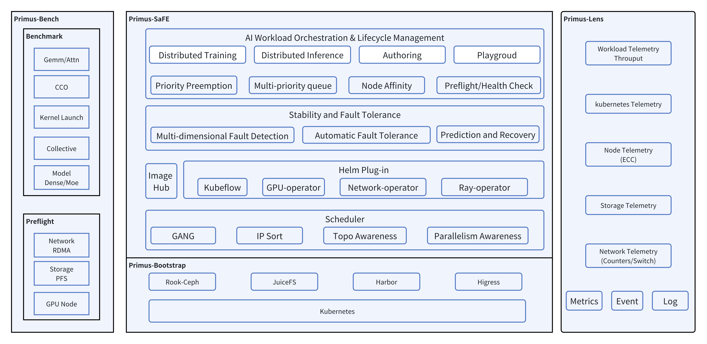

# Primus-SaFE

<div align="center">

**Stability at Scale: AMD’s Full‑Stack Platform for Large‑Model Training**

[](LICENSE)
[](https://kubernetes.io/)
[](https://rocm.docs.amd.com/)

</div>

---

## Overview

[Primus-SaFE](https://rocm.blogs.amd.com/software-tools-optimization/primus-SaFE/README.html) is AMD's comprehensive, full-stack platform designed to address the critical challenges of multi-node AI training on AMD GPU clusters. Training large AI models demands unwavering stability and robust debugging capabilities at cluster scale, yet today's ROCm-based multi-node GPU deployments often rely on brittle scripts and disjointed tools to launch distributed jobs, monitor performance, and recover from failures.

Primus-SaFE transforms a collection of AMD GPU servers into a resilient, self-monitoring environment for next-generation model training by automating everything from cluster provisioning and intelligent job scheduling to real-time monitoring and hardware health validation. Running atop Kubernetes and integrated with the ROCm software stack, it provides:

- **Automated Cluster Deployment**: Production-grade Kubernetes setup with optimized infrastructure
- **Intelligent Job Scheduling**: Multi-priority queues, automatic failover, and topology-aware placement
- **Full-Stack Observability**: Real-time metrics, interactive dashboards, and comprehensive telemetry
- **Preflight Validation**: Rigorous health checks and performance benchmarking before workload deployment
- **Fault Tolerance**: Automatic recovery mechanisms to minimize downtime and maximize goodput

---

## 🧩 Primus Product Matrix

|    Module    | Role | Key Features | Dependencies / Integration |
|--------------|------|--------------|-----------------------------|
| [**Primus-LM**](https://github.com/AMD-AGI/Primus)         | End-to-end training framework | - Supports multiple training backends (Megatron, TorchTitan, etc.)<br>- Provides high-performance, scalable distributed training<br>- Deeply integrates with Turbo and Safe | - Can invoke Primus-Turbo kernels and modules<br>- Runs on top of Primus-Safe for stable scheduling |
| [**Primus-Turbo**](https://github.com/AMD-AGI/Primus-Turbo)         | High-performance operators & modules | - Provides common LLM training operators (FlashAttention, GEMM, Collectives, GroupedGemm, etc.)<br>- Modular design, directly pluggable into Primus-LM<br>- Optimized for different architectures and precisions | - Built on [**AITER**](https://github.com/ROCm/aiter), [**CK**](https://github.com/ROCm/composable_kernel), [**hipBLASLt**](https://github.com/ROCm/hipBLASLt), [**Triton**](https://github.com/ROCm/triton)  and other operator libraries<br>- Can be enabled via configuration inside Primus-LM |
| [**Primus-SaFE**](https://github.com/AMD-AGI/Primus-SaFE)         | Stability & platform layer | - Cluster sanity check and benchmarking<br>- Kubernets scheduling with topology awareness<br>- Fault tolerance<br>- Stability enhancements | - Building a training platform based on the K8s and Slurm ecosystem |

---

## Table of Contents

- [Key Features](#key-features)
- [Architecture](#architecture)
- [Quick Start](#quick-start)
- [Core Modules](#core-modules)
  - [Primus-Bootstrap](#primus-bootstrap-rapid-cluster-deployment)
  - [Primus-SaFE Core](#primus-safe-platform-intelligent-job-scheduling-and-fault-tolerance)
  - [Primus-Lens](#primus-lens-full-stack-observability--visualization)
  - [Primus-Bench](#primus-bench-node-health-checks-and-performance-benchmarking)
  - [Scheduler Plugins](#scheduler-plugins-advanced-scheduling-capabilities)
- [Roadmap](#roadmap)
- [License](#license)
---

## Key Features

### 🚀 **High-Availability, High-Performance Infrastructure**

- **Rapid Deployment**: Automated Kubernetes cluster provisioning on bare-metal servers
- **Unified Storage**: JuiceFS for high-throughput distributed file system with client-side caching
- **Secure Registry**: Harbor for trusted container image management with RBAC
- **Scalable Gateway**: Higress API gateway for high-concurrency user-facing services

### 🧠 **Intelligent Scheduling and Resilience**

- **Multi-Priority Queuing**: Preemption support for urgent experiments
- **Automatic Failover**: Resume training from checkpoints when nodes or GPUs fail
- **Topology-Aware Placement**: Network-locality optimization for distributed training
- **Gang Scheduling**: Co-schedule interdependent pods for distributed workloads
- **Health Validation**: Preflight checks before scheduling production workloads

### 📊 **Comprehensive Monitoring and Insight**

- **Cluster-Wide Metrics**: Real-time GPU, CPU, memory, network, and I/O telemetry
- **Job-Level Tracking**: Training progress, throughput, loss curves, and checkpoint events
- **Interactive Dashboards**: Grafana-based visualization with custom alerts
- **Root Cause Analysis**: Correlated metrics and logs for quick issue diagnosis

### ✅ **Preflight Validation and Performance Consistency**

- **Hardware Diagnostics**: Verify GPUs, drivers, and network interfaces
- **Micro-Benchmarks**: Standard AI operations to detect underperforming nodes
- **Trial Runs**: Small-scale training jobs to validate end-to-end functionality
- **Performance Baselines**: Ensure all nodes meet minimum performance standards

### 📈 **Extreme Scalability**

- Tested on clusters from a few GPUs to **tens of thousands of GPUs**
- Architecture designed to handle **100,000+ GPU accelerators**
- Scales from small lab setups to massive enterprise deployments

---

## Architecture

Primus-SaFE's functionality is organized into four core modules that work together to provide a complete training platform:

---

## Quick Start

Follow these steps to deploy the complete Primus-SaFE platform on your AMD GPU cluster:

### 1. Clone the Repository

```bash
git clone https://github.com/AMD-AGI/Primus-SaFE.git
cd Primus-SaFE
```

### 2. Bootstrap the Kubernetes Cluster

```bash
cd Bootstrap

# Edit hosts.yaml to specify your cluster nodes and roles
vim hosts.yaml

# Run the bootstrap script to deploy Kubernetes
bash bootstrap.sh
```

This deploys a production-grade Kubernetes cluster with:
- High-availability control plane and etcd
- JuiceFS distributed storage
- Harbor container registry
- Higress API gateway

**See [Bootstrap/README.md](Bootstrap/README.md) for detailed configuration options.**

### 3. Deploy Observability with Primus-Lens

```bash
cd ../Lens/bootstrap

# Install Primus-Lens monitoring and logging components
bash install.sh
```

This installs:
- VictoriaMetrics for time-series metrics storage
- Grafana for dashboards and visualization
- OpenSearch for log aggregation
- Custom exporters for GPU, network, and workload metrics

**See [Lens/README.md](Lens/README.md) for configuration details.**

### 4. Install the Primus-SaFE Platform Layer

```bash
cd ../../SaFE/bootstrap

# Deploy Primus-SaFE stability and scheduling components
bash install.sh
```

This installs:
- API Server for unified management interface
- Job Manager for workload lifecycle management
- Resource Manager for cluster and node management
- Node Agent for health monitoring
- Webhooks for request validation and modification

**See [SaFE/README.md](SaFE/README.md) for detailed installation guide.**

### 5. (Optional) Run Health Checks with Primus-Bench

```bash
cd ../../Bench

# Edit hosts.ini to specify nodes to benchmark
vim hosts.ini

# Run preflight checks and benchmarks
bash run_bare_metal.sh
```

This runs:
- Node configuration and hardware checks
- Network connectivity and bandwidth tests
- I/O performance benchmarks
- Computation-communication overlap tests

**See [Bench/README.md](Bench/README.md) for different execution modes (bare-metal, SLURM, Kubernetes).**

---

## Core Modules

### Primus-Bootstrap: Rapid Cluster Deployment

**Location:** [`Bootstrap/`](Bootstrap/)

Primus-Bootstrap automates the deployment of a production-grade Kubernetes cluster on bare-metal servers, provisioning key infrastructure components optimized for AI workloads.

**Key Components:**
- **Kubernetes Cluster**: High-availability setup using Kubespray with redundant control-plane and etcd
- **JuiceFS Storage**: Distributed file system with metadata/data separation and client-side caching
- **Harbor Registry**: Secure container image management with RBAC and image scanning
- **Higress Gateway**: High-concurrency API gateway with WebAssembly plugin support

**Usage:**
```bash
cd Bootstrap
vim hosts.yaml  # Configure your cluster nodes
bash bootstrap.sh
```

**Learn More:** [Bootstrap/README.md](Bootstrap/README.md)

---

### Primus-SaFE Core: Intelligent Job Scheduling and Fault Tolerance

**Location:** [`SaFE/`](SaFE/)

The Primus-SaFE Core extends Kubernetes with AI-specific scheduling and fault tolerance capabilities to maximize throughput and reliability for long-running training jobs.

**Core Services:**

1. **API Server**: Unified interface for resource and workload management, user authentication, and SSH access
2. **Job Manager**: Full lifecycle management of PyTorchJob, Job, Deployment with intelligent scheduling, queuing, and automatic retry
3. **Resource Manager**: Centralized management of clusters, nodes, workspaces, storage, and operations
4. **Webhooks**: Kubernetes admission controller for request validation and resource modification
5. **Node Agent**: Node-level monitoring, fault detection, and self-healing capabilities

**Key Features:**
- Multi-priority queues with preemption
- Automatic failover and checkpoint resume
- Topology-aware placement (via custom scheduler plugins)
- Preflight validation with Primus-Bench integration
- Multi-tenant workspace isolation

**Usage:**
```bash
cd SaFE/bootstrap
bash install.sh
```

**Learn More:** [SaFE/README.md](SaFE/README.md)

---

### Primus-Lens: Full-Stack Observability & Visualization

**Location:** [`Lens/`](Lens/)

Primus-Lens provides comprehensive observability across infrastructure and training workloads with real-time metrics, logs, and interactive dashboards.

**Components:**

1. **Metrics Stack**:
   - VictoriaMetrics cluster for high-performance time-series storage
   - Custom exporters: GPU resources, network statistics, node hardware, workloads
   - VMAgent for metrics collection and aggregation

2. **Logging Stack**:
   - OpenSearch for distributed log storage and search
   - Fluent Bit for log collection and forwarding
   - Structured logging with correlation to metrics

3. **Visualization**:
   - Grafana with pre-built dashboards for cluster, node, GPU, and job metrics
   - Custom alerts and notifications
   - Training toolkit integration for job-level telemetry

4. **Storage**:
   - PostgreSQL for metadata and configuration storage

**Key Metrics:**
- GPU utilization, memory, temperature, power
- Network throughput, latency, packet loss, RDMA statistics
- Storage I/O, filesystem performance
- Training progress, throughput, loss curves, checkpoint timing
- Pod lifecycle, resource allocation, scheduling latency

**Usage:**
```bash
cd Lens/bootstrap
bash install.sh
```

**Configuration:** Edit `bootstrap/manifests/*.yaml.tpl` templates before installation.

---

### Primus-Bench: Node Health Checks and Performance Benchmarking

**Location:** [`Bench/`](Bench/)

Primus-Bench ensures every node in the cluster meets baseline performance standards before allowing it to run production training workloads.

**Test Categories:**

1. **Preflight Checks**:
   - SSH reachability and configuration
   - Environment variables and system settings
   - ROCm driver and GPU detection
   - Network connectivity and DNS resolution

2. **Hardware Diagnostics**:
   - GPU functionality and memory tests
   - RDMA device availability and configuration
   - Network interface verification

3. **Performance Benchmarks**:
   - I/O benchmarks (fio, IOR)
   - Computation-communication overlap tests
   - Kernel launch overhead measurements
   - RDMA bandwidth and latency tests

4. **Trial Training Runs**:
   - Small-scale distributed training jobs
   - Multi-node communication validation
   - End-to-end training pipeline verification

**Execution Modes:**
- **Bare Metal**: Ansible-driven execution across hosts
- **SLURM**: Resource allocation and batch job execution
- **Kubernetes**: PyTorchJob-based distributed testing

**Usage:**
```bash
cd Bench

# Bare metal mode
vim hosts.ini
bash run_bare_metal.sh

# SLURM mode
NNODES=4 PARTITION=gpu bash salloc_slurm.sh

# Kubernetes mode
kubectl apply -f kubernetes/pytorchjob.yaml
```

**Learn More:** [Bench/README.md](Bench/README.md)

---

### Scheduler Plugins: Advanced Scheduling Capabilities

**Location:** [`Scheduler-Plugins/`](Scheduler-Plugins/)

Custom Kubernetes scheduler plugins that extend the default scheduler with advanced capabilities tailored for AI workloads.

**Available Plugins:**

1. **TopologyIPSort**:
   - IP-based node sorting for network locality
   - Pod group support for gang scheduling
   - Priority-based queue sorting
   - Co-scheduling for distributed workloads
   - Kubeflow training workload integration

**Extension Points:**
- Score Plugin: Node evaluation and scoring
- Queue Sort Plugin: Custom pod ordering
- Permit Plugin: Co-scheduling and admission control
- Post Filter Plugin: Diagnostics and failure handling

**Usage:**
```bash
cd Scheduler-Plugins

# Install via Helm
helm install scheduler-plugins manifests/charts/scheduler-plugins/

# Use in pod specifications
spec:
  schedulerName: custom-scheduler
```

**Learn More:** [Scheduler-Plugins/README.md](Scheduler-Plugins/README.md)

---

## Roadmap

Primus-SaFE is under active development. Planned enhancements include:

- **Enhanced AMD Hardware Support**:
  - MI450 series GPU integration
  - Latest ROCm stack compatibility
  - 400 Gbps AI NIC optimization

- **Advanced Fault Tolerance**:
  - Process-level failover mechanisms
  - Asynchronous checkpointing
  - Redundant training processes
  - Graceful degradation strategies

- **Agentic Platform Automation**:
  - Multi-agent systems (LangGraph, CrewAI) for cluster operations
  - Natural-language cluster management
  - Automated deployment and optimization
  - Self-healing and self-tuning capabilities

- **AI-Powered Operations**:
  - Predictive failure detection
  - Automated performance optimization
  - Intelligent resource allocation

---


## License

This project is licensed under the **Apache License 2.0**. See the [LICENSE](LICENSE) file for full details.


