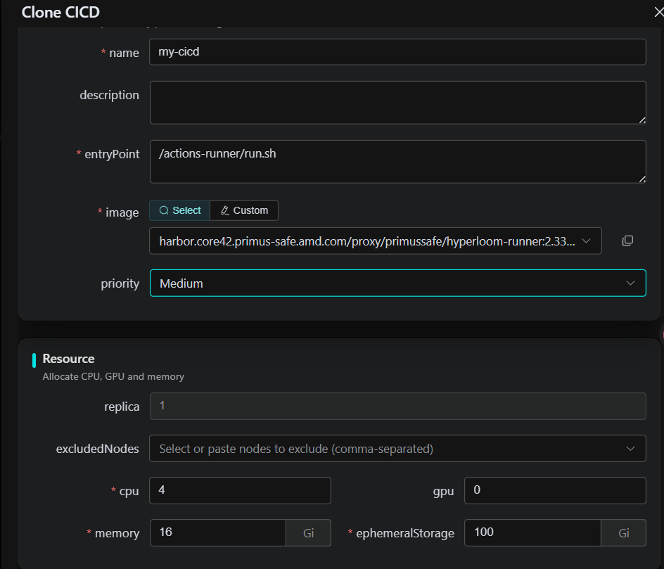
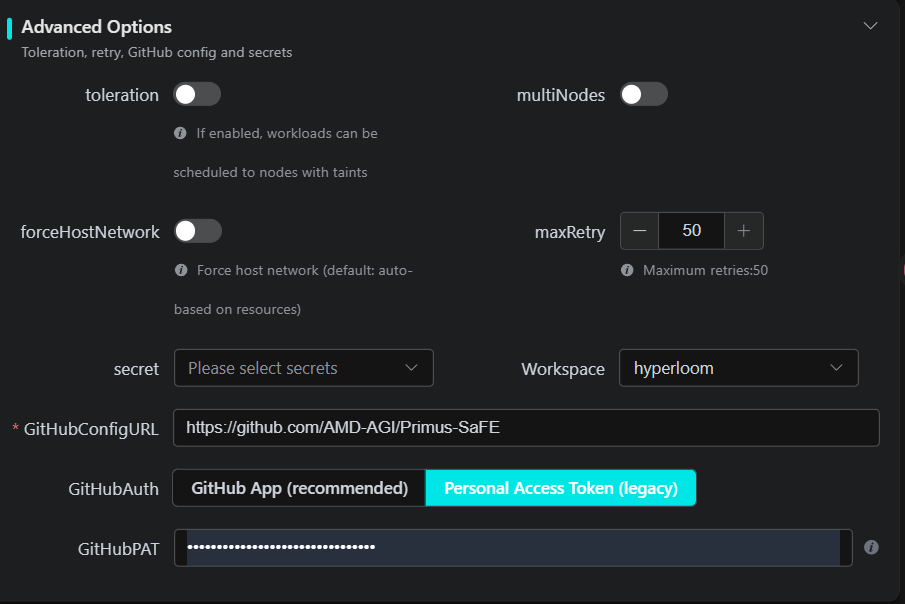

# SaFE CICD (GitHub Actions Runner) — Standalone guide

This document is self-contained: follow the sections in order to **build an image**, create an **`AutoscalingRunnerSet`** workload on SaFE via the **Workload API**, and—if you enable a **multi-node unified job**—see **§3** for the NFS request/result contract, coordinated by **SaFE** and the **Primus-SaFE Operator**.

---

## 1. Build the image

The build context directory must include this Dockerfile. The `setup-certs` step depends on a network script referenced in the Dockerfile; if your environment cannot reach that URL, switch to an internal certificate approach or remove the corresponding `RUN` line.

```dockerfile
FROM ubuntu:22.04

ARG RUNNER_VERSION=2.333.1

ENV DEBIAN_FRONTEND=noninteractive

RUN apt-get update && apt-get install -y --no-install-recommends \
    curl git python3 python3-pip jq ca-certificates \
    libicu-dev libssl-dev libkrb5-dev zlib1g-dev \
    && apt-get clean && rm -rf /var/lib/apt/lists/*

RUN curl -fsSL https://raw.githubusercontent.com/AMD-AGI/Primus-SaFE/main/Scripts/setup-certs/setup.sh | bash

# Unprivileged user: the Actions runner refuses to run as root by default and
# dropping root limits blast radius if a job is compromised.
RUN useradd --create-home --shell /bin/bash runner

WORKDIR /actions-runner

RUN curl -sL -o actions-runner.tar.gz \
       "https://github.com/actions/runner/releases/download/v${RUNNER_VERSION}/actions-runner-linux-x64-${RUNNER_VERSION}.tar.gz" \
    && tar xzf actions-runner.tar.gz \
    && rm actions-runner.tar.gz \
    && ./bin/installdependencies.sh \
    && chown -R runner:runner /actions-runner

LABEL runner.version="${RUNNER_VERSION}"

USER runner

# Liveness: healthy only while the runner listener process is up.
HEALTHCHECK --interval=30s --timeout=5s --start-period=120s --retries=3 \
    CMD pgrep -f "Runner.Listener|run.sh" >/dev/null 2>&1 || exit 1

CMD ["bash"]
```

---
## 2. Create a CICD workload on SaFE (required)

### 2.0 Create via SaFE Console (optional)

If you create CICD through the **SaFE Web Console** instead of calling the API directly, use the UI wizard: **Clone CICD** for name, description, entry command, image, priority, and Runner resources; then expand **Advanced Options** for multi-node, Workspace, `GitHubConfigURL`, `GitHubAuth` (GitHub App or PAT), and related settings. These fields align with the **JSON / API** contract below.





### 2.1 API and authentication

- **Method / path**: `POST /api/v1/workloads`
- **Full URL**: `https://<your-safe-api-host>/api/v1/workloads` (replace `<your-safe-api-host>` with your real hostname or gateway).
- **Authentication**: Same as other Workload APIs; you may send `Authorization: Bearer <your-api-key>`, replacing `<your-api-key>` with an API key issued on the **SaFE platform**.
- **Headers**: `Content-Type: application/json`; when using API key auth, also send `Authorization` as above.

### 2.2 Request body structure (JSON)

A single request includes:

- **Workload spec** (fields aligned with the Workload CR): `groupVersionKind`, `resources`, `env`, `workspace`, etc.
- **Create API extras**: At minimum **`displayName`**, **`githubAuth`** for GitHub credentials, and **`workspace`** (string: namespace / workspace ID).

**Kind**: `groupVersionKind.kind` must be **`AutoscalingRunnerSet`**; `groupVersionKind.version` is **`v1`**.

### 2.3 Required CICD keys in `env`

These keys must exist with non-empty string values, or validation fails:

| Key | Description |
|-----|---------------|
| `GITHUB_CONFIG_URL` | GitHub repository or organization URL, e.g. `https://github.com/OWNER/REPO`. |
| `IMAGE` | **Runner container image** that runs GitHub jobs (address pullable from the cluster). |
| `ENTRYPOINT` | Command to start the Runner container above, **Base64**-encoded as one line (no newlines). It must match a real path in the image (if you built from the sample Dockerfile above, the path is `/actions-runner/run.sh`, e.g. `L2FjdGlvbnMtcnVubmVyL3J1bi5zaA==`). |
| `RESOURCES` | **JSON string** (single line) describing Runner Pod resources; include at least the fields the server validates, e.g. `replica`, `cpu`, `gpu`, `memory`, `ephemeralStorage`, with valid quantities and units. |

**Do not conflate the two resource blocks**:

- **`resources[0]`**: Resources for SaFE **proxy / control-plane** Pods—usually small, `replica` **1**.
- **`env.RESOURCES`**: After parsing, resources for **Runner** Pods—the capacity your CI actually uses.

**`UNIFIED_JOB_ENABLE`**: String **`"true"`** or **`"false"`**. If **`"true"`** (multi-node, etc.), the workload must have **workspace storage** enabled (`useWorkspaceStorage: true` on create—default is true), and the workspace must meet CICD storage needs (e.g. NFS—exact rules depend on cluster config). The webhook rejects the request if requirements are not met.

### 2.4 Base64-encoding `ENTRYPOINT`

On Linux, encode the **full start command** (as in the image), for example:

```bash
echo -n '/actions-runner/run.sh' | base64 -w0
```

### 2.5 GitHub credentials: `githubAuth` (recommended)

Add **`githubAuth`** at the **root** of the JSON (avoid leaving a long-lived PAT only in `env`):

| `githubAuth.type` | Required fields |
|-------------------|-----------------|
| `pat` | `token`: GitHub PAT with permissions sufficient to register runners for that repo/org. |
| `github_app` | `appId`, `installationId`, `privateKey`: GitHub App installation credentials. |

### 2.6 Full create example (edit placeholders and send)

Replace `your-name`, `your-workspace`, `https://github.com/OWNER/REPO`, `IMAGE`, `ENTRYPOINT`, and `your-token` with your values.

```json
{
  "displayName": "your-name",
  "groupVersionKind": {
    "kind": "AutoscalingRunnerSet",
    "version": "v1"
  },
  "resources": [{
    "replica": 1,
    "cpu": "1",
    "memory": "4Gi",
    "ephemeralStorage": "10Gi"
  }],
  "workspace": "your-workspace",
  "env": {
    "UNIFIED_JOB_ENABLE": "false",
    "GITHUB_CONFIG_URL": "https://github.com/OWNER/REPO",
    "RESOURCES": "{\"replica\":1,\"cpu\":\"4\",\"gpu\":\"0\",\"memory\":\"16Gi\",\"sharedMemory\":\"8Gi\",\"ephemeralStorage\":\"100Gi\"}",
    "IMAGE": "harbor.core42.primus-safe.amd.com/proxy/primussafe/hyperloom-runner:2.333.1",
    "ENTRYPOINT": "L2FjdGlvbnMtcnVubmVyL3J1bi5zaA=="
  },
  "githubAuth": {
    "type": "pat",
    "token": "your-token"
  }
}
```

**Successful response** (HTTP 2xx): JSON shaped like:

```json
{
  "workloadId": "workload-id"
}
```

Keep `workloadId`; use it for later get/stop/delete/PATCH operations.

### 2.7 Rotate PAT or App credentials (PATCH)

- **Path**: `PATCH /api/v1/workloads/<workloadId>`
- **Authentication**: Same as create.

To rotate only the token, you may send:

```json
{
  "githubAuth": {
    "type": "pat",
    "token": "ghp_new_token"
  }
}
```

### 2.8 Pre-create checklist

1. The cluster has CICD / Runner scale set features enabled; creation fails otherwise.  
2. `IMAGE` is pullable in the Runner namespace (including `imagePullSecrets` if required).  
3. `GITHUB_CONFIG_URL` matches PAT / App scope (repository vs organization).  
4. After Base64 decode, `ENTRYPOINT` exists and is executable **inside the `IMAGE` container**.  
5. `env.RESOURCES` is valid JSON and stays within workspace / cluster policy.

### 2.9 `runs-on` and other workflow fields

In your repository workflow YAML, if a job runs on this platform’s Runner scale set, **`runs-on`** is usually the **scale set name**; that name typically matches the **`workloadId`** returned after a successful CICD workload create (if GitHub console naming differs, follow the name actually registered).

Aside from `runs-on` and a few runner-specific settings, everything else follows **standard GitHub Actions workflow fields** (e.g. `on`, `jobs`, `steps`, `uses`). For build/test/release tasks, follow the [GitHub Actions documentation](https://docs.github.com/en/actions) (e.g. [Workflow syntax](https://docs.github.com/en/actions/using-workflows/workflow-syntax-for-github-actions)).

---

## 3. Multi-node unified job (`UNIFIED_JOB_ENABLE=true`)

With **`"UNIFIED_JOB_ENABLE": "true"`** on the **AutoscalingRunnerSet** `env`, **SaFE** (via **Primus-SaFE Operator**) uses **NFS** to hand off a **UnifiedJob**: your CI script writes a **request** JSON to an input file; the platform creates/reconciles the job and writes a **result** JSON with **`phase`**. This is a **SaFE extension**—**standard GitHub Actions** is **single-node** per `runs-on` job; this path offloads **multi-node** training/batch work to the cluster while GitHub still triggers the workflow.

**Prerequisites:** `useWorkspaceStorage: true` (default) and an **NFS-capable** workspace. Injected env (typical): **`SAFE_NFS_PATH`**, **`POD_NAME`**, **`SAFE_NFS_INPUT`**, **`SAFE_NFS_OUTPUT`** — last two are **relative** paths under the per-pod root.

```text
NFS_ROOT=${SAFE_NFS_PATH}/${POD_NAME}
INPUT_FILE=${NFS_ROOT}/${SAFE_NFS_INPUT}
OUTPUT_FILE=${NFS_ROOT}/${SAFE_NFS_OUTPUT}
```

```text
Your script (e.g. unified_runner.py)          SaFE + Primus-SaFE Operator
        │                                              │
        ├─► Write INPUT_FILE (JSON request)           │
        │                                              ├─► Detect input file (periodic check)
        │                                              ├─► Parse JSON → submit UnifiedJob
        │                                              ├─► Reconcile Kubernetes workload / Pods
        │                                              ├─► Track workload phase (control plane)
        │                                              └─► On terminal phase → write OUTPUT_FILE JSON
        ├─► Poll OUTPUT_FILE until JSON has terminal phase
        └─► Interpret phase (Succeeded / Failed / Stopped)
```

The platform polls workload status on an **internal interval** (tens of seconds); your script may poll **`OUTPUT_FILE`** more often until **`phase`** is terminal.

**Request JSON** (minimal contract):

| Keys | Required | Notes |
|------|:--------:|-------|
| `model`, `command`, `image` | ✅ | `command` is Base64-encoded into the workload entrypoint. |
| `resources` (`replica`, `gpu`, `cpu`, `memory`; optional `ephemeralStorage`, `sharedMemory`) | ✅ / optional fields | `replica` is split into head (`1`) + worker (`N-1`). |
| `env` | ❌ | Merged into workload `env`; platform injects scale-set / NFS-related keys. |
| `timeout` (seconds) | ❌ | Integer **> 0** overrides default **259200** wait for a terminal phase. |

Create **`NFS_ROOT`** before writing (usually the Runner creates it when unified mode is on). When building the **UnifiedJob**, SaFE sets workload **`env.SAFE_NFS_PATH`** to **`NFS_ROOT`**, overriding the same key from your request JSON if present.

Example:

```json
{
  "model": "primus_pyt_megatron_lm_train_llama-2-7b",
  "command": "bash /wekafs/.../ci/scripts/training_wrapper.sh ...",
  "image": "harbor.example.com/sync/rocm/...",
  "resources": {
    "replica": 2,
    "gpu": "8",
    "cpu": "96",
    "memory": "1024Gi",
    "ephemeralStorage": "512Gi",
    "sharedMemory": "512Gi"
  },
  "env": { "NCCL_DEBUG": "INFO" },
  "timeout": 18000
}
```

**Output JSON** (`OUTPUT_FILE`)

SaFE writes a single JSON object. Example — success:

```json
{
  "phase": "Succeeded"
}
```

Other terminal values for **`phase`**:

```json
{ "phase": "Failed" }
```

```json
{ "phase": "Stopped" }
```

| `phase` | Meaning |
|---------|---------|
| `Succeeded` | Job finished successfully. |
| `Failed` | Job failed, input/create/parse/runtime error, or platform-side timeout. |
| `Stopped` | Job was stopped (e.g. cleanup / user stop). |

Treat **`Succeeded`** as success; **`Failed`** / **`Stopped`** as non-success per your policy. Poll **`OUTPUT_FILE`** until **`phase`** is one of the above.

**Checklist:** set **`UNIFIED_JOB_ENABLE`** to **`"true"`** on create (§2.6); confirm **`SAFE_NFS_PATH`**, **`POD_NAME`**, **`SAFE_NFS_INPUT`**, **`SAFE_NFS_OUTPUT`**; write **`INPUT_FILE`**, poll **`OUTPUT_FILE`**; align **`timeout`** with how long the job may run.

---
