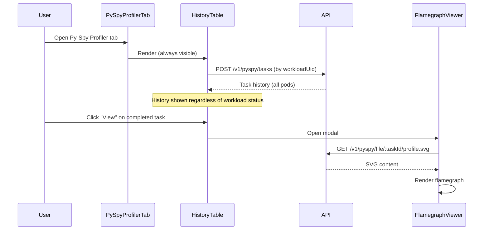
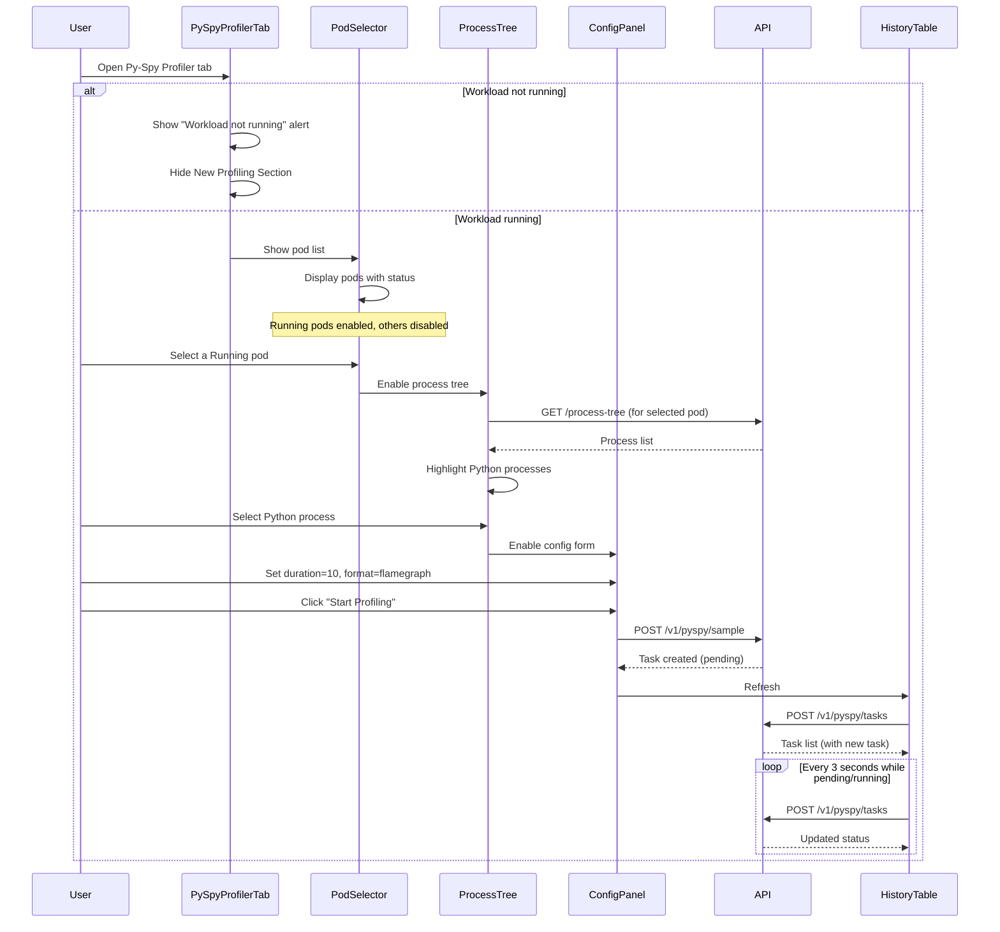
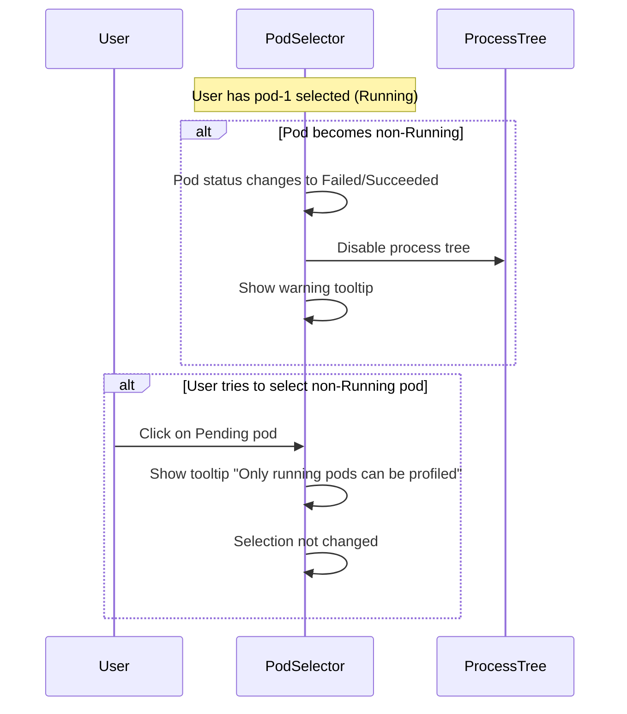
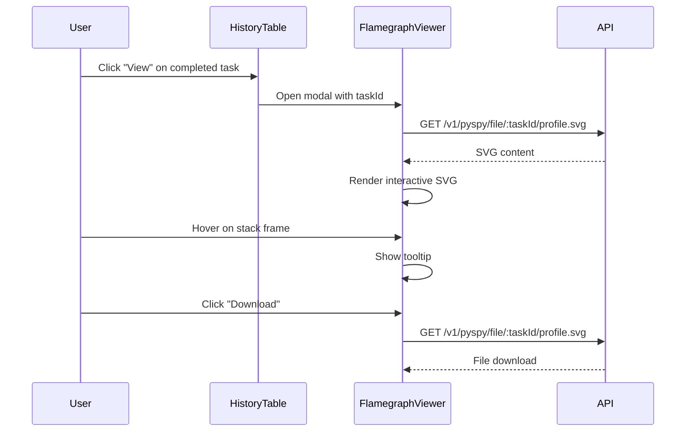

# Py-Spy Frontend Product Design

## Overview

This document describes the frontend implementation for Py-Spy profiling feature in Primus Lens Web. The feature enables users to profile Python processes running in Kubernetes pods directly from the workload detail page.

## User Stories

1. **As a developer**, I want to view profiling history for my workload even after it has completed, so that I can analyze past profiling results.
2. **As a developer**, I want to select a specific pod from my multi-pod workload before profiling, so that I can profile the right instance.
3. **As a developer**, I want to see all Python processes running in the selected pod so that I can identify which process to profile.
4. **As a developer**, I want to trigger a py-spy sampling on a specific Python process with configurable parameters.
5. **As a developer**, I want only running pods to be selectable for profiling, so that I don't accidentally try to profile terminated pods.
6. **As a developer**, I want to analyze flamegraphs directly in the browser without downloading files.

## Feature Location

The Py-Spy feature will be integrated into the existing `WorkloadDetail.vue` page:

```
Workloads → Workload Detail → Py-Spy Profiler Tab
```

## UI Design

### Page Layout

```
┌─────────────────────────────────────────────────────────────────────────────┐
│  WorkloadDetail Page                                                        │
├───────────────┬─────────────────────────────────────────────────────────────┤
│               │  ┌─────────────────────────────────────────────────────────┐│
│  Workload     │  │  [Overview] [Profiler Files] [Py-Spy Profiler]         ││
│  Hierarchy    │  └─────────────────────────────────────────────────────────┘│
│  Tree         │                                                             │
│               │  ┌─────────────────────────────────────────────────────────┐│
│  ├─ Job       │  │  Py-Spy Profiler Tab                                   ││
│  │  ├─ Pod1   │  │                                                         ││
│  │  └─ Pod2   │  │  ┌─────────────────────────────────────────────────────┐││
│               │  │  │ Profiling History (Always Visible)                  │││
│               │  │  │ ┌───────────────────────────────────────────────┐  │││
│               │  │  │ │ Task ID    │ Pod  │ PID  │ Status │ Actions   │  │││
│               │  │  │ │ pyspy-xxx  │ pod1 │ 123  │ ✓ Done │ 📥 👁     │  │││
│               │  │  │ │ pyspy-yyy  │ pod2 │ 456  │ ⏳ Run │ ❌        │  │││
│               │  │  │ └───────────────────────────────────────────────┘  │││
│               │  │  └─────────────────────────────────────────────────────┘││
│               │  │                                                         ││
│               │  │  ┌─────────────────────────────────────────────────────┐││
│               │  │  │ New Profiling Task (Only when workload is running) │││
│               │  │  │                                                     │││
│               │  │  │  ┌─────────────────────────────────────────────┐   │││
│               │  │  │  │ Select Pod:  [pod-master-0 ▼] (3 running)   │   │││
│               │  │  │  │ ┌─────────────────────────────────────────┐ │   │││
│               │  │  │  │ │ ○ pod-master-0  (Running) ✓ Selected    │ │   │││
│               │  │  │  │ │ ○ pod-worker-0  (Running)               │ │   │││
│               │  │  │  │ │ ○ pod-worker-1  (Running)               │ │   │││
│               │  │  │  │ │ ○ pod-worker-2  (Pending) [Disabled]    │ │   │││
│               │  │  │  │ └─────────────────────────────────────────┘ │   │││
│               │  │  │  └─────────────────────────────────────────────┘   │││
│               │  │  │                                                     │││
│               │  │  │  ┌─────────────────┐  ┌─────────────────────────┐  │││
│               │  │  │  │ Process Tree    │  │ Sampling Configuration  │  │││
│               │  │  │  │                 │  │                         │  │││
│               │  │  │  │ ├─ python (123) │  │ Duration: [30] seconds  │  │││
│               │  │  │  │ │  ├─ worker   │  │ Rate: [100] Hz          │  │││
│               │  │  │  │ │  └─ worker   │  │ Format: [Flamegraph ▼]  │  │││
│               │  │  │  │ └─ gunicorn    │  │ □ Native stacks         │  │││
│               │  │  │  │                 │  │ □ Subprocesses          │  │││
│               │  │  │  │ [🔄 Refresh]    │  │                         │  │││
│               │  │  │  └─────────────────┘  │ [Start Profiling]       │  │││
│               │  │  │                       └─────────────────────────┘  │││
│               │  │  └─────────────────────────────────────────────────────┘││
│               │  └─────────────────────────────────────────────────────────┘│
└───────────────┴─────────────────────────────────────────────────────────────┘
```

### Layout States

#### State 1: Workload Not Running (Completed/Failed)
```
┌─────────────────────────────────────────────────────────────────────────────┐
│  Py-Spy Profiler Tab                                                        │
├─────────────────────────────────────────────────────────────────────────────┤
│  ┌─────────────────────────────────────────────────────────────────────────┐│
│  │ Profiling History                                                [🔄]   ││
│  │ ┌───────────────────────────────────────────────────────────────────┐  ││
│  │ │ Task ID     │ Pod Name  │ PID  │ Status │ Duration │ Actions     │  ││
│  │ │ pyspy-xxx   │ pod1      │ 123  │ ✓ Done │ 10s      │ 📥 👁       │  ││
│  │ │ pyspy-yyy   │ pod2      │ 456  │ ✓ Done │ 30s      │ 📥 👁       │  ││
│  │ └───────────────────────────────────────────────────────────────────┘  ││
│  └─────────────────────────────────────────────────────────────────────────┘│
│                                                                             │
│  ┌─────────────────────────────────────────────────────────────────────────┐│
│  │  ⚠️ Workload is not running. New profiling tasks cannot be created.    ││
│  │     Start a new workload to enable profiling.                           ││
│  └─────────────────────────────────────────────────────────────────────────┘│
└─────────────────────────────────────────────────────────────────────────────┘
```

#### State 2: No Running Pods
```
┌─────────────────────────────────────────────────────────────────────────────┐
│  Py-Spy Profiler Tab                                                        │
├─────────────────────────────────────────────────────────────────────────────┤
│  ┌─────────────────────────────────────────────────────────────────────────┐│
│  │ Profiling History                                                [🔄]   ││
│  │ (empty or with historical data)                                         ││
│  └─────────────────────────────────────────────────────────────────────────┘│
│                                                                             │
│  ┌─────────────────────────────────────────────────────────────────────────┐│
│  │  ⚠️ No running pods available.                                          ││
│  │     Wait for pods to be in Running state to enable profiling.           ││
│  └─────────────────────────────────────────────────────────────────────────┘│
└─────────────────────────────────────────────────────────────────────────────┘
```

### Flamegraph Viewer Modal

```
┌─────────────────────────────────────────────────────────────────────────────┐
│  Flamegraph Viewer                                                    [X]   │
├─────────────────────────────────────────────────────────────────────────────┤
│  Task: pyspy-9657adaf  │  PID: 12345  │  Duration: 10s  │  Format: SVG      │
├─────────────────────────────────────────────────────────────────────────────┤
│                                                                             │
│  ┌─────────────────────────────────────────────────────────────────────────┐│
│  │                                                                         ││
│  │                        [Interactive SVG Flamegraph]                     ││
│  │                                                                         ││
│  │     ┌─────────────────────────────────────────────────────────┐         ││
│  │     │                     main                                │         ││
│  │     ├──────────────────────┬──────────────────────────────────┤         ││
│  │     │     process_data     │           train_model            │         ││
│  │     ├───────┬──────────────┼────────────┬─────────────────────┤         ││
│  │     │ load  │   transform  │  forward   │      backward       │         ││
│  │     └───────┴──────────────┴────────────┴─────────────────────┘         ││
│  │                                                                         ││
│  └─────────────────────────────────────────────────────────────────────────┘│
│                                                                             │
│  [Download SVG]  [Open in Speedscope]  [Copy Link]                          │
└─────────────────────────────────────────────────────────────────────────────┘
```

## Component Architecture

```
WorkloadDetail.vue
├── PySpyProfilerTab.vue (New)
│   ├── ProfilingHistoryTable.vue (New)        ← Always visible at top
│   ├── WorkloadNotRunningAlert.vue (New)      ← Show when workload not running
│   └── NewProfilingSection.vue (New)          ← Only when workload is running
│       ├── PodSelector.vue (New)              ← Select from running pods
│       ├── ProcessTreePanel.vue (New)         ← Show after pod selected
│       │   └── ProcessTreeNode.vue (New)
│       └── SamplingConfigPanel.vue (New)
├── FlamegraphViewer.vue (New)
│   ├── SvgFlamegraph.vue (New)
│   └── SpeedscopeViewer.vue (New)
└── ProfilerFilesList.vue (Existing)
```

### Component Visibility Rules

| Component | Condition |
|-----------|-----------|
| ProfilingHistoryTable | Always visible |
| WorkloadNotRunningAlert | `workload.status !== 'running'` |
| NewProfilingSection | `workload.status === 'running'` |
| PodSelector | `workload.status === 'running' && pods.length > 0` |
| ProcessTreePanel | `selectedPod !== null && selectedPod.status === 'Running'` |
| SamplingConfigPanel | `selectedPod !== null && selectedProcess !== null` |

## Detailed Component Specifications

### 1. PySpyProfilerTab.vue

Main container component for the Py-Spy profiler feature.

**Props:**
```typescript
interface Props {
  workloadUid: string
  workloadStatus: 'running' | 'completed' | 'failed' | 'pending'
  pods: PodInfo[]           // All pods in this workload
  cluster?: string
}

interface PodInfo {
  uid: string
  name: string
  namespace: string
  nodeName: string
  status: 'Running' | 'Pending' | 'Succeeded' | 'Failed' | 'Unknown'
  containerStatuses: ContainerStatus[]
}
```

**State:**
```typescript
interface State {
  selectedPod: PodInfo | null
  selectedProcess: ProcessInfo | null
  samplingConfig: SamplingConfig
  profilingTasks: PySpyTask[]
  isLoading: boolean
  isRefreshing: boolean
}

interface SamplingConfig {
  duration: number      // 1-300 seconds, default: 30
  rate: number          // 1-1000 Hz, default: 100
  format: 'flamegraph' | 'speedscope' | 'raw'
  native: boolean       // Include native stacks
  subprocesses: boolean // Profile subprocesses
}
```

**Computed:**
```typescript
// Check if workload is running
const isWorkloadRunning = computed(() => props.workloadStatus === 'running')

// Filter only running pods
const runningPods = computed(() => 
  props.pods.filter(pod => pod.status === 'Running')
)

// Check if profiling can be started
const canStartProfiling = computed(() => 
  isWorkloadRunning.value && 
  selectedPod.value !== null && 
  selectedProcess.value !== null
)
```

### 2. PodSelector.vue (New)

Displays a list of pods for selection, with only Running pods selectable.

**Props:**
```typescript
interface Props {
  pods: PodInfo[]
  selectedPod: PodInfo | null
  disabled: boolean
}
```

**Emits:**
```typescript
interface Emits {
  (e: 'select', pod: PodInfo): void
}
```

**Features:**
- Display all pods in the workload
- Show pod status with visual indicator (green for Running, gray for others)
- Only Running pods are clickable/selectable
- Non-running pods show disabled state with tooltip explaining why
- Show pod count summary (e.g., "3 running / 5 total")

**Template Structure:**
```vue
<template>
  <div class="pod-selector">
    <div class="pod-selector-header">
      <span>Select Pod</span>
      <el-tag size="small">{{ runningCount }} running / {{ totalCount }} total</el-tag>
    </div>
    
    <el-radio-group v-model="selectedPodUid" @change="handleSelect">
      <div v-for="pod in pods" :key="pod.uid" class="pod-item">
        <el-radio 
          :value="pod.uid"
          :disabled="pod.status !== 'Running'"
        >
          <span class="pod-name">{{ pod.name }}</span>
          <el-tag 
            :type="pod.status === 'Running' ? 'success' : 'info'"
            size="small"
          >
            {{ pod.status }}
          </el-tag>
          <span class="pod-node">on {{ pod.nodeName }}</span>
        </el-radio>
        
        <el-tooltip 
          v-if="pod.status !== 'Running'" 
          content="Only running pods can be profiled"
        >
          <el-icon><Warning /></el-icon>
        </el-tooltip>
      </div>
    </el-radio-group>
  </div>
</template>
```

### 3. ProcessTreePanel.vue

Displays the process tree for the selected pod. Only shown when a Running pod is selected.

**Props:**
```typescript
interface Props {
  pod: PodInfo              // Selected pod (must be Running)
  cluster?: string
}
```

**Emits:**
```typescript
interface Emits {
  (e: 'select', process: ProcessInfo): void
  (e: 'refresh'): void
}
```

**Visibility Condition:**
```typescript
// Only render when pod is selected and running
v-if="selectedPod && selectedPod.status === 'Running'"
```

**Data Model:**
```typescript
interface ProcessInfo {
  pid: number
  hostPid: number
  ppid: number
  command: string
  cmdline: string[]
  isPython: boolean
  cpuPercent: number
  memoryPercent: number
  children: ProcessInfo[]
  containerPid?: number
  capabilities?: string[]
}
```

**Features:**
- Tree view of all processes in the pod
- Python processes highlighted with special icon
- Expandable/collapsible nodes
- Process search/filter
- Real-time refresh capability
- Show CPU/Memory usage

**API Call:**
```typescript
// GET /v1/workloads/:uid/processes?pod_uid=xxx&cluster=xxx
// Or use node-exporter proxy API
// POST /v1/node-exporter/process-tree/pod
```

### 3. SamplingConfigPanel.vue

Configuration form for py-spy sampling parameters.

**Props:**
```typescript
interface Props {
  selectedProcess: ProcessInfo | null
  disabled: boolean
}
```

**Emits:**
```typescript
interface Emits {
  (e: 'start', config: SamplingConfig): void
}
```

**Form Fields:**

| Field | Type | Default | Range | Description |
|-------|------|---------|-------|-------------|
| Duration | Number | 30 | 1-300 | Sampling duration in seconds |
| Rate | Number | 100 | 1-1000 | Sampling rate in Hz |
| Format | Select | flamegraph | flamegraph/speedscope/raw | Output format |
| Native | Checkbox | false | - | Include native stack frames |
| Subprocesses | Checkbox | false | - | Profile subprocesses |

**Validation:**
- Duration: Required, 1-300 seconds
- Rate: Required, 1-1000 Hz
- Process must be selected before starting

### 4. ProfilingHistoryTable.vue

Table showing profiling task history. **Always visible** at the top of the tab, regardless of workload status.

**Props:**
```typescript
interface Props {
  workloadUid: string       // Query tasks by workload UID
  cluster?: string
}
```

**Note:** This component queries tasks by `workloadUid` (not `podUid`) so it shows all historical tasks across all pods in the workload.

**Columns:**

| Column | Description |
|--------|-------------|
| Task ID | Unique task identifier (with copy button) |
| Pod Name | Target pod name (important for multi-pod workloads) |
| PID | Target process ID |
| Status | pending/running/completed/failed/cancelled |
| Format | flamegraph/speedscope/raw |
| Duration | Sampling duration |
| File Size | Output file size |
| Created At | Task creation time |
| Actions | View/Download/Cancel buttons |

**Empty State:**
- When no history: "No profiling history yet. Start a profiling task to see results here."

**Status Icons:**
- ⏳ Pending - Gray spinner
- 🔄 Running - Blue spinner with progress
- ✅ Completed - Green checkmark
- ❌ Failed - Red X with error tooltip
- 🚫 Cancelled - Gray slash

**Actions:**
- 👁 View - Open flamegraph viewer (for completed tasks)
- 📥 Download - Download profile file
- ❌ Cancel - Cancel running/pending task
- 🗑 Delete - Delete task (future)

### 5. FlamegraphViewer.vue

Modal dialog for viewing flamegraph profiles.

**Props:**
```typescript
interface Props {
  visible: boolean
  taskId: string
  format: 'flamegraph' | 'speedscope'
  cluster?: string
}
```

**Features:**
- Inline SVG rendering for flamegraphs
- Interactive zoom and pan
- Search functionality in flamegraph
- Tooltip showing function details
- Full-screen mode
- Download button
- Open in Speedscope link

**For Speedscope Format:**
- Embed speedscope viewer or
- Provide link to open in speedscope.app
- Download JSON file option

### 6. SvgFlamegraph.vue

SVG flamegraph renderer with interactivity.

**Props:**
```typescript
interface Props {
  svgContent: string
  searchTerm?: string
}
```

**Features:**
- Render SVG inline
- Preserve interactivity from py-spy generated SVG
- Add search highlighting
- Responsive sizing
- Loading state

## API Integration

### Required API Endpoints

#### 1. Get Process Tree (via node-exporter proxy or direct)

```typescript
// Option A: Proxy through API
POST /v1/workloads/:uid/process-tree
{
  "pod_uid": "xxx",
  "cluster": "production"
}

// Option B: Direct to node-exporter (requires node routing)
POST http://node-exporter:8989/v1/process-tree/python
{
  "pod_uid": "xxx"
}
```

**Response:**
```typescript
interface ProcessTreeResponse {
  processes: ProcessInfo[]
  capabilities: string[]
  supported: boolean
  checkedAt: string
}
```

#### 2. Create Profiling Task

```typescript
POST /v1/pyspy/sample
{
  "pod_uid": "xxx",
  "pod_name": "training-job-master-0",
  "pod_namespace": "default",
  "node_name": "gpu-node-1",
  "pid": 12345,
  "duration": 30,
  "rate": 100,
  "format": "flamegraph",
  "native": false,
  "subprocesses": false,
  "cluster": "production"
}
```

#### 3. List Profiling Tasks

```typescript
POST /v1/pyspy/tasks
{
  "workload_uid": "xxx",    // Query by workload UID to get all tasks across all pods
  "pod_uid": "xxx",         // Optional: filter by specific pod
  "cluster": "production",
  "limit": 20
}
```

**Note:** Use `workload_uid` to query all historical tasks for the workload (across all pods). This allows viewing history even after the workload has completed.

#### 4. Get Task Status

```typescript
GET /v1/pyspy/task/:taskId?cluster=production
```

#### 5. Download Profile File

```typescript
GET /v1/pyspy/file/:taskId/:filename?cluster=production
```

#### 6. Cancel Task

```typescript
POST /v1/pyspy/task/:taskId/cancel?cluster=production
```

### API Service Module

Create new service file: `src/services/pyspy/index.ts`

```typescript
import request from '@/utils/request'

export interface ProcessInfo {
  pid: number
  hostPid: number
  ppid: number
  command: string
  cmdline: string[]
  isPython: boolean
  cpuPercent: number
  memoryPercent: number
  children: ProcessInfo[]
}

export interface PySpyTask {
  taskId: string
  status: 'pending' | 'running' | 'completed' | 'failed' | 'cancelled'
  podUid: string
  podName: string
  podNamespace: string
  nodeName: string
  pid: number
  duration: number
  format: string
  outputFile?: string
  fileSize?: number
  error?: string
  createdAt: string
  startedAt?: string
  completedAt?: string
  filePath?: string
}

export interface CreateTaskParams {
  podUid: string
  podName?: string
  podNamespace?: string
  nodeName: string
  pid: number
  duration?: number
  rate?: number
  format?: string
  native?: boolean
  subprocesses?: boolean
  cluster?: string
}

// Get process tree for a pod
export function getProcessTree(params: {
  workloadUid: string
  podUid: string
  cluster?: string
}) {
  return request.post(`/v1/workloads/${params.workloadUid}/process-tree`, {
    pod_uid: params.podUid,
    cluster: params.cluster
  })
}

// Create py-spy sampling task
export function createPySpyTask(params: CreateTaskParams) {
  return request.post('/v1/pyspy/sample', {
    pod_uid: params.podUid,
    pod_name: params.podName,
    pod_namespace: params.podNamespace,
    node_name: params.nodeName,
    pid: params.pid,
    duration: params.duration || 30,
    rate: params.rate || 100,
    format: params.format || 'flamegraph',
    native: params.native || false,
    subprocesses: params.subprocesses || false,
    cluster: params.cluster
  })
}

// List py-spy tasks (by workloadUid to get all tasks across all pods)
export function listPySpyTasks(params: {
  workloadUid?: string    // Query by workload UID (recommended for history)
  podUid?: string         // Optional: filter by specific pod
  podNamespace?: string
  status?: string
  cluster?: string
  limit?: number
  offset?: number
}) {
  return request.post('/v1/pyspy/tasks', {
    workload_uid: params.workloadUid,
    pod_uid: params.podUid,
    pod_namespace: params.podNamespace,
    status: params.status,
    cluster: params.cluster,
    limit: params.limit,
    offset: params.offset
  })
}

// Get task details
export function getPySpyTask(taskId: string, cluster?: string) {
  return request.get(`/v1/pyspy/task/${taskId}`, {
    params: { cluster }
  })
}

// Get task file info
export function getPySpyFileInfo(taskId: string, cluster?: string) {
  return request.get(`/v1/pyspy/file/${taskId}`, {
    params: { cluster }
  })
}

// Download profile file
export function downloadPySpyFile(taskId: string, filename: string, cluster?: string) {
  return request.get(`/v1/pyspy/file/${taskId}/${filename}`, {
    params: { cluster },
    responseType: 'blob'
  })
}

// Get profile file content as text (for SVG viewing)
export function getPySpyFileContent(taskId: string, filename: string, cluster?: string) {
  return request.get(`/v1/pyspy/file/${taskId}/${filename}`, {
    params: { cluster },
    responseType: 'text'
  })
}

// Cancel task
export function cancelPySpyTask(taskId: string, cluster?: string, reason?: string) {
  return request.post(`/v1/pyspy/task/${taskId}/cancel`, {
    reason
  }, {
    params: { cluster }
  })
}
```

## State Management

### Composable: usePySpyProfiler

Create `src/composables/usePySpyProfiler.ts`:

```typescript
import { ref, computed, watch, Ref } from 'vue'
import { ElMessage } from 'element-plus'
import * as pyspyApi from '@/services/pyspy'

interface PodInfo {
  uid: string
  name: string
  namespace: string
  nodeName: string
  status: string
}

export function usePySpyProfiler(
  workloadUid: Ref<string>,
  workloadStatus: Ref<string>,
  pods: Ref<PodInfo[]>,
  cluster?: Ref<string>
) {
  // Pod selection
  const selectedPod = ref<PodInfo | null>(null)
  
  // Process tree for selected pod
  const processes = ref<ProcessInfo[]>([])
  const selectedProcess = ref<ProcessInfo | null>(null)
  
  // Task history (for entire workload, not just selected pod)
  const tasks = ref<PySpyTask[]>([])
  
  // Loading states
  const isLoadingProcesses = ref(false)
  const isLoadingTasks = ref(false)
  const isCreatingTask = ref(false)
  
  // Polling interval for task status updates
  let pollingInterval: number | null = null
  
  // Computed properties
  const isWorkloadRunning = computed(() => 
    workloadStatus.value === 'running'
  )
  
  const runningPods = computed(() => 
    pods.value.filter(pod => pod.status === 'Running')
  )
  
  const hasPendingTasks = computed(() => 
    tasks.value.some(t => t.status === 'pending' || t.status === 'running')
  )
  
  const canStartProfiling = computed(() => 
    isWorkloadRunning.value && 
    selectedPod.value !== null && 
    selectedPod.value.status === 'Running' &&
    selectedProcess.value !== null
  )
  
  // Select a pod (only if Running)
  function selectPod(pod: PodInfo) {
    if (pod.status !== 'Running') {
      ElMessage.warning('Only running pods can be profiled')
      return
    }
    selectedPod.value = pod
    selectedProcess.value = null
    processes.value = []
  }
  
  // Load process tree for selected pod
  async function loadProcessTree() {
    if (!selectedPod.value || selectedPod.value.status !== 'Running') {
      return
    }
    
    isLoadingProcesses.value = true
    try {
      const res = await pyspyApi.getProcessTree({
        workloadUid: workloadUid.value,
        podUid: selectedPod.value.uid,
        cluster: cluster?.value
      })
      processes.value = res.processes || []
    } catch (error) {
      ElMessage.error('Failed to load process tree')
    } finally {
      isLoadingProcesses.value = false
    }
  }
  
  // Load task history for entire workload (always available)
  async function loadTasks() {
    if (!workloadUid.value) return
    
    isLoadingTasks.value = true
    try {
      // Query by workloadUid to get all tasks across all pods
      const res = await pyspyApi.listPySpyTasks({
        workloadUid: workloadUid.value,
        cluster: cluster?.value,
        limit: 50
      })
      tasks.value = res.tasks || []
    } catch (error) {
      ElMessage.error('Failed to load profiling tasks')
    } finally {
      isLoadingTasks.value = false
    }
  }
  
  // Create profiling task
  async function createTask(config: SamplingConfig) {
    if (!canStartProfiling.value) {
      ElMessage.warning('Cannot start profiling: check pod and process selection')
      return
    }
    
    isCreatingTask.value = true
    try {
      const res = await pyspyApi.createPySpyTask({
        podUid: selectedPod.value!.uid,
        podName: selectedPod.value!.name,
        podNamespace: selectedPod.value!.namespace,
        nodeName: selectedPod.value!.nodeName,
        pid: selectedProcess.value!.hostPid,
        duration: config.duration,
        rate: config.rate,
        format: config.format,
        native: config.native,
        subprocesses: config.subprocesses,
        cluster: cluster?.value
      })
      
      ElMessage.success(`Profiling task ${res.taskId} created`)
      await loadTasks()
      startPolling()
      
      return res
    } catch (error) {
      ElMessage.error('Failed to create profiling task')
    } finally {
      isCreatingTask.value = false
    }
  }
  
  async function cancelTask(taskId: string) {
    try {
      await pyspyApi.cancelPySpyTask(taskId, cluster?.value)
      ElMessage.success('Task cancelled')
      await loadTasks()
    } catch (error) {
      ElMessage.error('Failed to cancel task')
    }
  }
  
  function startPolling() {
    if (pollingInterval) return
    
    pollingInterval = window.setInterval(() => {
      if (hasPendingTasks.value) {
        loadTasks()
      } else {
        stopPolling()
      }
    }, 3000)
  }
  
  function stopPolling() {
    if (pollingInterval) {
      clearInterval(pollingInterval)
      pollingInterval = null
    }
  }
  
  // Auto-select first running pod when pods change
  watch(runningPods, (newPods) => {
    if (newPods.length > 0 && !selectedPod.value) {
      selectPod(newPods[0])
    }
  }, { immediate: true })
  
  // Clear process selection when pod changes
  watch(selectedPod, () => {
    selectedProcess.value = null
    processes.value = []
  })
  
  // Load tasks on mount (always, regardless of workload status)
  // This is called by the component on mount
  
  return {
    // Pod selection
    selectedPod,
    runningPods,
    selectPod,
    
    // Process tree
    processes,
    selectedProcess,
    isLoadingProcesses,
    loadProcessTree,
    
    // Tasks (history)
    tasks,
    isLoadingTasks,
    isCreatingTask,
    hasPendingTasks,
    loadTasks,
    createTask,
    cancelTask,
    
    // Computed
    isWorkloadRunning,
    canStartProfiling,
    
    // Polling
    startPolling,
    stopPolling
  }
}
```

## UI Flow

### Flow 1: View Profiling History (Always Available)



### Flow 2: Profile a Python Process (Only When Workload Running)



### Flow 3: Handle Pod Status Changes



### Flow 2: View Flamegraph



## Error Handling

### Error States

| Error | Display | Action |
|-------|---------|--------|
| Workload not running | Info alert at top | Show historical tasks only |
| No running pods | Warning alert | Suggest waiting for pods to start |
| Pod selection required | Disabled button + tooltip | Guide user to select pod |
| Process tree load failed | Toast + empty state | Retry button |
| No Python processes found | Info banner | Suggest checking if Python is running |
| CAP_SYS_PTRACE missing | Warning banner | Show requirements |
| Task creation failed | Error toast | Show error message |
| Task execution failed | Status: failed + error tooltip | Show error details |
| File download failed | Error toast | Retry option |
| SVG render failed | Error state in viewer | Download fallback |

### Workload Status Alerts

```vue
<!-- Workload not running -->
<el-alert
  v-if="!isWorkloadRunning"
  type="info"
  title="Workload Not Running"
  description="New profiling tasks cannot be created. You can still view historical profiling results."
  show-icon
  :closable="false"
/>

<!-- No running pods -->
<el-alert
  v-else-if="runningPods.length === 0"
  type="warning"
  title="No Running Pods"
  description="All pods are in non-running state. Wait for pods to be Running to start profiling."
  show-icon
  :closable="false"
/>
```

### Permission Check

Before allowing profiling, check if the container has required capabilities:

```typescript
function checkPySpyCompatibility(capabilities: string[]): boolean {
  return capabilities.includes('CAP_SYS_PTRACE')
}
```

Display warning if not supported:

```vue
<el-alert
  v-if="selectedPod && !isPySpySupported"
  type="warning"
  title="Py-Spy Not Supported"
  description="The container does not have CAP_SYS_PTRACE capability required for py-spy profiling."
  show-icon
  :closable="false"
/>
```

## Responsive Design

### Breakpoints

| Breakpoint | Layout |
|------------|--------|
| >= 1200px | Side-by-side: Process tree (40%) + Config (60%) |
| 768-1199px | Stacked: Process tree above Config |
| < 768px | Full width, collapsible sections |

### Mobile Considerations

- Collapsible process tree
- Simplified flamegraph viewer (no zoom, just scroll)
- Touch-friendly buttons
- Reduced polling frequency on mobile

## Performance Considerations

1. **Process Tree Loading**
   - Lazy load on tab activation
   - Debounce refresh requests
   - Cache process tree for 30 seconds

2. **Task List Polling**
   - Only poll when there are pending/running tasks
   - Increase interval when tab is not visible
   - Stop polling when component unmounts

3. **SVG Rendering**
   - Lazy load flamegraph content
   - Use virtual scrolling for large flamegraphs
   - Consider WebGL rendering for very large profiles

4. **File Downloads**
   - Show progress for large files
   - Support resumable downloads
   - Compress response when possible

## Accessibility

- Keyboard navigation for process tree
- ARIA labels for all interactive elements
- Screen reader support for status changes
- High contrast mode support
- Focus management in modal dialogs

## Internationalization

Key strings to translate:

```typescript
const i18n = {
  'pyspy.title': 'Py-Spy Profiler',
  'pyspy.processTree': 'Process Tree',
  'pyspy.samplingConfig': 'Sampling Configuration',
  'pyspy.history': 'Profiling History',
  'pyspy.startProfiling': 'Start Profiling',
  'pyspy.duration': 'Duration (seconds)',
  'pyspy.rate': 'Sample Rate (Hz)',
  'pyspy.format': 'Output Format',
  'pyspy.native': 'Include Native Stacks',
  'pyspy.subprocesses': 'Profile Subprocesses',
  'pyspy.status.pending': 'Pending',
  'pyspy.status.running': 'Running',
  'pyspy.status.completed': 'Completed',
  'pyspy.status.failed': 'Failed',
  'pyspy.status.cancelled': 'Cancelled',
  'pyspy.view': 'View',
  'pyspy.download': 'Download',
  'pyspy.cancel': 'Cancel',
  'pyspy.noProcesses': 'No Python processes found',
  'pyspy.notSupported': 'Py-Spy profiling is not supported for this container',
}
```

## Testing Strategy

### Unit Tests

- Process tree rendering
- Sampling config validation
- Task status mapping
- API service functions

### Integration Tests

- Create task flow
- Cancel task flow
- File download flow
- Error handling

### E2E Tests

- Full profiling workflow
- Flamegraph viewer interaction
- Multi-cluster support

## Implementation Phases

### Phase 1: Core Functionality (MVP)
- [ ] PySpyProfilerTab container component
- [ ] ProfilingHistoryTable component (always visible)
- [ ] PodSelector component (only running pods selectable)
- [ ] ProcessTreePanel component (after pod selected)
- [ ] SamplingConfigPanel component
- [ ] API service integration
- [ ] Workload status check (enable/disable new profiling section)
- [ ] Basic error handling and alerts

### Phase 2: Flamegraph Viewer
- [ ] FlamegraphViewer modal
- [ ] SVG inline rendering
- [ ] Interactive features (hover, zoom)
- [ ] Download functionality

### Phase 3: Polish & Enhancement
- [ ] Real-time status updates (polling)
- [ ] Pod status change handling
- [ ] Search in process tree
- [ ] Advanced filtering in history
- [ ] Performance optimization

### Phase 4: Advanced Features
- [ ] Speedscope integration
- [ ] Comparison view (diff two profiles)
- [ ] Profile sharing
- [ ] Scheduled profiling

## File Structure

```
src/
├── pages/
│   └── Workloads/
│       └── WorkloadDetail.vue (modified)
├── components/
│   └── pyspy/
│       ├── PySpyProfilerTab.vue           # Main container
│       ├── ProfilingHistoryTable.vue      # Always visible, shows all tasks
│       ├── NewProfilingSection.vue        # Only when workload running
│       ├── PodSelector.vue                # Select from running pods
│       ├── ProcessTreePanel.vue           # Show after pod selected
│       ├── ProcessTreeNode.vue            # Tree node component
│       ├── SamplingConfigPanel.vue        # Config form
│       ├── FlamegraphViewer.vue           # Modal for viewing
│       └── SvgFlamegraph.vue              # SVG renderer
├── composables/
│   └── usePySpyProfiler.ts
├── services/
│   └── pyspy/
│       └── index.ts
└── types/
    └── pyspy.ts
```

## Dependencies

### New Dependencies

| Package | Version | Purpose |
|---------|---------|---------|
| None | - | Using native Vue 3 + Element Plus |

### Existing Dependencies Used

- Vue 3
- Element Plus (UI components)
- Axios (HTTP requests)
- Day.js (Date formatting)

## References

- [Py-Spy GitHub](https://github.com/benfred/py-spy)
- [Speedscope](https://www.speedscope.app/)
- [Flamegraph.js](https://github.com/nicescale/flamegraph.js)
- [Element Plus Documentation](https://element-plus.org/)

---

## Changelog

| Version | Date | Author | Changes |
|---------|------|--------|---------|
| 1.0.0 | 2026-01-07 | - | Initial design |
| 1.1.0 | 2026-01-07 | - | Added multi-pod support: PodSelector component, only running pods selectable, profiling history always visible at top, workload status checks |

