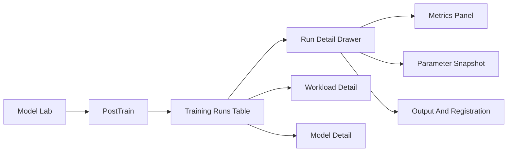

# PostTrain Frontend Design

## Final Decision

This document now serves as the final product direction for `PostTrain`.

The final decisions are:

- training is created from `Model Lab -> PostTrain`
- `Model Square` does not own training buttons
- SaFE stores the canonical training run record in `posttrain_run`
- Lens is the preferred source for `loss` and structured training metrics
- frontend should consume structured backend APIs instead of parsing raw logs in browser

If any later section still mentions old `Phase 1 / Phase 2` exploration language, the above final decisions take precedence.

## 1. 目标

在 `Model Lab` 下新增一个统一模块，用来记录和查看 `SFT` 与 `RL` 的训练运行历史，而不是让用户分别去 `Workload`、`Model Square`、日志页面和训练弹窗里拼上下文。

推荐命名：

- 一级模块：`PostTrain`
- 主表标题：`Training Runs`
- 行详情抽屉：`Run Detail`

不建议直接把表叫做 `Model Lab`，因为 `Model Lab` 更适合作为导航容器名，而不是具体数据对象。

## 2. 用户诉求

这张表主要服务三类用户：

- 领导 / PM：快速看当前有哪些训练在跑、哪些成功、哪些失败、哪些还在待验证
- 算法 / 平台同学：快速定位某次训练用了什么参数、产出了什么模型、当前状态是什么
- 一线排障同学：快速跳到 workload 详情、日志、导出目录、模型注册结果

## 3. 页面定位

建议将 `PostTrain` 作为 `Model Lab` 下的新入口，而不是塞进现有创建训练弹窗或 `Workload` 页面中。

推荐信息架构：



## 4. 页面布局建议

整体风格建议直接对齐现有 `Training` / `RayJob` 页面：

- 顶部筛选区
- 中间表格区
- 底部分页
- 最右侧行操作

不建议在正式版首页加入 summary cards。

### 4.1 Filter Bar

建议支持这些筛选项：

- `Train Type`: `SFT` / `RL`
- `Strategy`: `full` / `lora` / `fsdp2` / `megatron`
- `Status`: `Pending` / `Running` / `Succeeded` / `Failed` / `Stopped` / `Pending Validation`
- `Workspace`
- `Base Model`
- `Dataset`
- `Owner`
- `Date Range`

### 4.2 主表列建议

| 列名 | 说明 |
|------|------|
| Run Name / ID | 训练显示名和运行 ID |
| Train Type | `SFT` / `RL` |
| Strategy | `full` / `lora` / `fsdp2` / `megatron` |
| Base Model | 基础模型名 |
| Dataset | 数据集显示名 |
| Workspace | 所属 workspace |
| Status | workload 状态 + 产品化标签 |
| Nodes x GPUs | 资源规模摘要 |
| Key Params | 一行摘要参数 |
| Latest Loss | 最近 loss，没有则显示 `-` |
| Output | 输出路径 / model 注册摘要 |
| Created Time | 创建时间 |
| Duration | 运行时长 |
| Owner | 用户 |
| Actions | Detail / Logs / Workload / Model / Delete Record |

### 4.3 Pagination

分页是正式版必选项。

推荐行为：

- 默认每页 `20`
- 支持切换 `20 / 50 / 100`
- 筛选变化后自动回到第一页
- 与现有 `Training` / `RayJob` 页面交互保持一致

## 5. Run Detail Drawer

建议点击一行后打开详情抽屉，而不是在表里塞太多列。

抽屉分成 4 个区块：

### 5.1 Basic Info

- `workloadId`
- `trainType`
- `strategy`
- `workspace`
- `status`
- `phase message`
- `owner`
- `image`

### 5.2 Resource Snapshot

- `nodeCount`
- `gpuPerNode`
- `cpu`
- `memory`
- `sharedMemory`
- `ephemeralStorage`

### 5.3 Parameter Snapshot

统一显示训练参数，但做归一化输出：

- 通用：
  - `lr`
  - `batchSize`
  - `epochs`
  - `saveFreq`
  - `testFreq`
- SFT:
  - `peft`
  - `tp`
  - `trainIters`
  - `warmupSteps`
- RL:
  - `algorithm`
  - `rewardType`
  - `rolloutN`
  - `rolloutTpSize`
  - `klLossCoef`
  - `tp/pp/cp`（Megatron）

### 5.4 Output And Registration

- `exportEnabled`
- `outputPath`
- `modelId`
- `modelStatus`
- `modelOrigin`

### 5.5 Metrics Panel

建议在抽屉中放图表，而不是把 loss 挤进主表。

候选图：

- `train loss`
- `eval metric`
- `reward`
- `throughput`
- `GPU util`

## 6. 创建训练

`PostTrain` 页面本身必须负责创建 `SFT` 与 `RL`。

### 6.1 创建入口

- 右上角按钮：`Create Training`
- 点击后打开大抽屉或全屏表单

不建议用小弹窗。

### 6.2 基础字段

两类训练共享：

- `displayName`
- `workspace`
- `baseModel`
- `dataset`
- `image`
- `nodeCount`
- `gpuCount`
- `cpu`
- `memory`
- `sharedMemory`
- `ephemeralStorage`
- `priority`
- `timeout`
- `exportModel`

### 6.3 高级选项

高级选项必须保留，但默认折叠。

#### SFT 高级选项

- `minLr`
- `lrWarmupIters`
- `evalInterval`
- `saveInterval`
- `precisionConfig`
- `tensorModelParallelSize`
- `pipelineModelParallelSize`
- `contextParallelSize`
- `sequenceParallel`
- `hostpath`
- `forceHostNetwork`
- `env`

#### RL 高级选项

- `saveFreq`
- `testFreq`
- `maxPromptLength`
- `maxResponseLength`
- `microBatchSizePerGpu`
- `gradClip`
- `klLossCoef`
- `rolloutGpuMemory`
- `rolloutTpSize`
- `paramOffload`
- `optimizerOffload`
- `gradOffload`
- `megatron tp / pp / cp`
- `env`

## 7. 正式版后端数据来源

正式版约定：

- SaFE 存正式训练记录表：`posttrain_run`
- SaFE 提供列表 / 详情 / 指标 API
- Lens 提供 `loss` 和训练指标聚合

前端不直接解析 workload logs。

### 7.1 主要 API

- `GET /api/v1/posttrain/runs`
- `GET /api/v1/posttrain/runs/:id`
- `GET /api/v1/posttrain/runs/:id/metrics`
- `DELETE /api/v1/posttrain/runs/:id`

创建训练继续复用：

- `POST /api/v1/sft/jobs`
- `POST /api/v1/rl/jobs`

配置继续复用：

- `GET /api/v1/playground/models/:id/sft-config`
- `GET /api/v1/playground/models/:id/rl-config`

### 7.2 Loss / 指标来源

正式版至少要支持 `loss`。

后端应按 `workload_uid` 从 Lens 聚合：

- `/api/v1/workloads/:uid/metrics/available`
- `/api/v1/workloads/:uid/metrics/data`
- `/api/v1/workloads/:uid/metrics/sources`

首要目标：

- 主表展示 `Latest Loss`
- 详情抽屉展示 `loss` 曲线

如果 Lens 没有结构化数据：

- 主表显示 `-`
- 详情显示 `No structured metrics available`
- 不阻塞页面加载

## 8. Run Detail Drawer

建议点击行后打开抽屉，而不是跳独立详情页。

### 8.1 Basic

- `runId`
- `workloadId`
- `workloadUid`
- `status`
- `workspace`
- `user`
- `image`

### 8.2 Resource Snapshot

- `nodeCount`
- `gpuPerNode`
- `cpu`
- `memory`
- `sharedMemory`
- `ephemeralStorage`

### 8.3 Parameter Snapshot

- 参数摘要
- 原始参数 JSON

### 8.4 Output / Registration

- `exportEnabled`
- `outputPath`
- `modelId`
- `modelDisplayName`
- `modelPhase`
- `modelOrigin`

### 8.5 Metrics

至少支持：

- `Latest Loss`
- `loss chart`

可选继续扩展：

- `accuracy`
- `throughput`
- `reward`
- `tokens/s`

## 9. Actions 设计

主表右侧操作建议：

- `Detail`
- `Logs`
- `Workload`
- `Model`（有导出结果时）
- `Delete Record`

### 9.1 Delete Record

`Delete Record` 只删除 `posttrain_run` 记录。

不应默认删除真实 workload。

### 9.2 Workload 操作

如果需要管理真实 workload，应在 `Detail` 里或通过跳转 workload 页面处理：

- `Stop Workload`
- `Delete Workload`

这样能把：

- 训练台账
- 真实运行实体

两个概念区分开。

## 10. 正式版表格返回结构

建议前端最终消费统一对象：

```ts
export interface PostTrainRunItem {
  runId: string
  workloadId: string
  workloadUid?: string
  displayName: string
  trainType: 'sft' | 'rl'
  strategy: 'full' | 'lora' | 'fsdp2' | 'megatron'
  algorithm?: string
  workspace: string
  cluster: string
  userId?: string
  userName?: string
  baseModelId: string
  baseModelName: string
  datasetId: string
  datasetName?: string
  image?: string
  nodeCount?: number
  gpuPerNode?: number
  cpu?: string
  memory?: string
  sharedMemory?: string
  ephemeralStorage?: string
  priority?: number
  timeout?: number
  exportModel: boolean
  outputPath?: string
  status: string
  createdAt?: string
  startTime?: string
  endTime?: string
  duration?: string
  modelId?: string
  modelDisplayName?: string
  modelPhase?: string
  modelOrigin?: string
  parameterSummary?: string
  latestLoss?: number | null
  lossMetricName?: string
  lossDataSource?: string
}
```

## 11. 参数摘要展示建议

主表里不建议把所有参数拆成很多列，建议只显示一列 `Key Params`。

推荐格式：

- SFT full:
  - `full | lr=5e-6 | iters=100 | save=50`
- SFT lora:
  - `lora | lr=1e-4 | dim=16 | alpha=32`
- RL fsdp2:
  - `grpo | fsdp2 | batch=64 | epochs=2`
- RL megatron:
  - `grpo | megatron | tp=4 pp=1 cp=1 | batch=256`

完整参数留给 `Detail` 抽屉。

## 12. 与其它文档的关系

- `training-frontend-design.md`
  - 定义训练入口迁移到 `PostTrain`
- `posttrain-frontend-design.md`
  - 定义 `PostTrain` 页面本身
  - 定义 `Training Runs` 表
  - 定义 `loss` 与指标的展示方式

## 13. 最终建议

正式版交付口径：

1. 训练统一从 `PostTrain` 创建
2. 页面风格跟现有 `Training` / `RayJob` 保持一致
3. 必须分页
4. 不放 summary cards
5. 至少支持 `Latest Loss` 与 `loss` 图表
6. `Delete Record` 与 `Delete Workload` 分离
