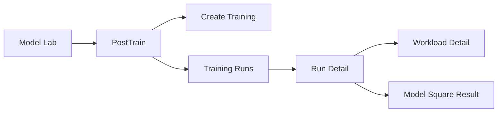

# Training Frontend Design

## 1. Final Product Direction

This is the final frontend direction for training in `Web/apps/safe`.

The key product decision is:

- training should **not** be created from `Model Square`
- training should be created from **`Model Lab -> PostTrain`**
- `Model Square` remains responsible for:
  - browsing base models
  - browsing exported models
  - deployment / inference-related actions
  - lineage display for fine-tuned or RL-trained outputs

This means the earlier design that added training buttons directly on model cards is no longer the target design.

## 2. Related Docs

- `posttrain-frontend-design.md`
  - final design for the `PostTrain` page
  - defines the `Training Runs` table
  - defines create-flow, run detail, and metrics behavior
- `sft-frontend-design.md`
  - historical SFT-specific design notes

## 3. Information Architecture



## 4. User Entry

### 4.1 Primary Entry

Primary training entry is:

- `Model Lab -> PostTrain -> Create Training`

### 4.2 Model Square Role

`Model Square` no longer shows a training button in the final design.

It should still support:

- base model browsing
- exported model browsing
- model owner / lineage display
- deploy / start service actions

Optional future enhancement:

- `Model Square` may provide a deep link such as `Train in PostTrain`
- this is not the primary `v1` experience
- it is not required for the first release

## 5. Create Training Flow

The `PostTrain` page should own the creation flow for both `SFT` and `RL`.

```text
Model Lab
  -> PostTrain
  -> Create Training
  -> choose train type (SFT / RL)
  -> choose base model
  -> choose dataset
  -> fill parameters
  -> submit
  -> return to Training Runs
  -> track status / output / metrics
```

## 6. Create Training UI

### 6.1 Page-Level Placement

Recommended structure:

- `PostTrain` page contains:
  - filter bar
  - training runs table
  - pagination
  - `Create Training` button
- clicking `Create Training` opens:
  - a full-page create flow
  - or a large drawer

Recommendation:

- use a large drawer or full-page flow
- do not use a small modal

### 6.2 Unified Create Entry

The create flow should start with:

- `Train Type`
  - `SFT`
  - `RL`

Then diverge into train-type-specific forms.

### 6.3 Shared Fields

Shared fields for both `SFT` and `RL`:

- `displayName`
- `workspace`
- `baseModel`
- `dataset`
- `image`
- `nodeCount`
- `gpuCount`
- `cpu`
- `memory`
- `sharedMemory`
- `ephemeralStorage`
- `priority`
- `timeout`
- `exportModel`

### 6.4 SFT-Specific Fields

- `peft`
- `datasetFormat`
- `trainIters`
- `globalBatchSize`
- `microBatchSize`
- `seqLength`
- `finetuneLr`
- `minLr`
- `lrWarmupIters`
- `evalInterval`
- `saveInterval`
- `tensorModelParallelSize`
- `pipelineModelParallelSize`
- `contextParallelSize`
- `sequenceParallel`
- `peftDim`
- `peftAlpha`

### 6.5 RL-Specific Fields

- `strategy`
  - `fsdp2`
  - `megatron`
- `algorithm`
  - `grpo`
  - `ppo`
- `rewardType`
- `trainBatchSize`
- `actorLr`
- `miniPatchSize`
- `microBatchSizePerGpu`
- `rolloutN`
- `rolloutTpSize`
- `rolloutGpuMemory`
- `totalEpochs`
- `saveFreq`
- `testFreq`
- `klLossCoef`
- `gradClip`
- megatron parallelism fields

## 7. Backend Contract

### 7.1 Create APIs

The final frontend still uses the existing backend creation APIs:

- `POST /api/v1/sft/jobs`
- `POST /api/v1/rl/jobs`

The change is only the **frontend entry point**, not the fundamental backend contract.

### 7.2 Config APIs

Frontend should still fetch backend defaults from:

- `GET /api/v1/playground/models/:id/sft-config`
- `GET /api/v1/playground/models/:id/rl-config`

So the `PostTrain` create flow becomes:

1. select base model
2. call config API
3. hydrate defaults
4. select dataset
5. submit to SFT or RL create API

## 8. Data Tracking After Submit

After submit succeeds, the frontend should not jump back to `Model Square`.

Instead:

- return to `PostTrain`
- highlight the newly created run
- optionally open the run detail drawer

Expected returned IDs:

- `workloadId` from SFT or RL create API
- `runId` in `PostTrain` should map 1:1 to `workloadId`

## 9. Training Runs Table

The detailed table definition lives in `posttrain-frontend-design.md`.

At minimum, the table should surface:

- `runName`
- `trainType`
- `strategy`
- `baseModel`
- `dataset`
- `workspace`
- `status`
- `export`
- `output`
- `createdAt`
- `duration`
- `latestLoss` if available
- `actions`

The page should follow the same overall interaction style as existing `Training` and `RayJob` pages:

- filters on top
- list table in the middle
- pagination at the bottom
- row actions on the far right
- no summary cards in the first official release

## 10. Metrics and Loss

Final direction:

- the canonical run record lives in SaFE (`posttrain_run`)
- training metrics such as `loss` come from Lens aggregation

Frontend should treat loss as:

- optional but first-class
- shown when available
- blank when Lens has no structured metric for that run

Do not require frontend-side log parsing.

## 11. Model Square Changes

### 11.1 Remove Training Entry

Remove training entry from:

- `ModelSquare/index.vue`
- `ModelSquareDetail.vue`

This means:

- no `TrainDropdown`
- no `CreateRlDialog` launched from model cards
- no `CreateSftDialog` launched from model cards

### 11.2 Keep Deployment / Browsing Semantics

`Model Square` should still:

- show base models
- show exported `fine_tuned` and `rl_trained` models
- show owner / base model / source job information
- support deployment for deployable local models

## 12. File Direction

### Keep

- `services/sft/*`
- `services/rl/*`
- `services/playground/*`

### New / Main Product Page

- `pages/PostTrain/index.vue`
- `pages/PostTrain/Components/CreateTrainingDrawer.vue`
- `pages/PostTrain/Components/SftTrainingForm.vue`
- `pages/PostTrain/Components/RlTrainingForm.vue`
- `pages/PostTrain/Components/RunDetailDrawer.vue`

### Remove Training Responsibility From

- `pages/ModelSquare/index.vue`
- `pages/ModelSquare/ModelSquareDetail.vue`

They may still link to `PostTrain`, but should not own training creation UI.

## 13. RL UI Status

Current reality:

- RL backend exists
- RL UI is not fully shipped yet

Therefore this document should be treated as the final target design for the first real UI implementation, not as a description of the current shipped behavior.

## 14. Final Recommendation

For the first actual release of the training UI:

- build `PostTrain` as the only training creation entry
- keep `Model Square` focused on model inventory and deployment
- use existing SFT / RL create APIs behind the `PostTrain` create flow
- use `posttrain_run` as the source of truth for runs
- use Lens as the source of `loss` and training metrics when available
