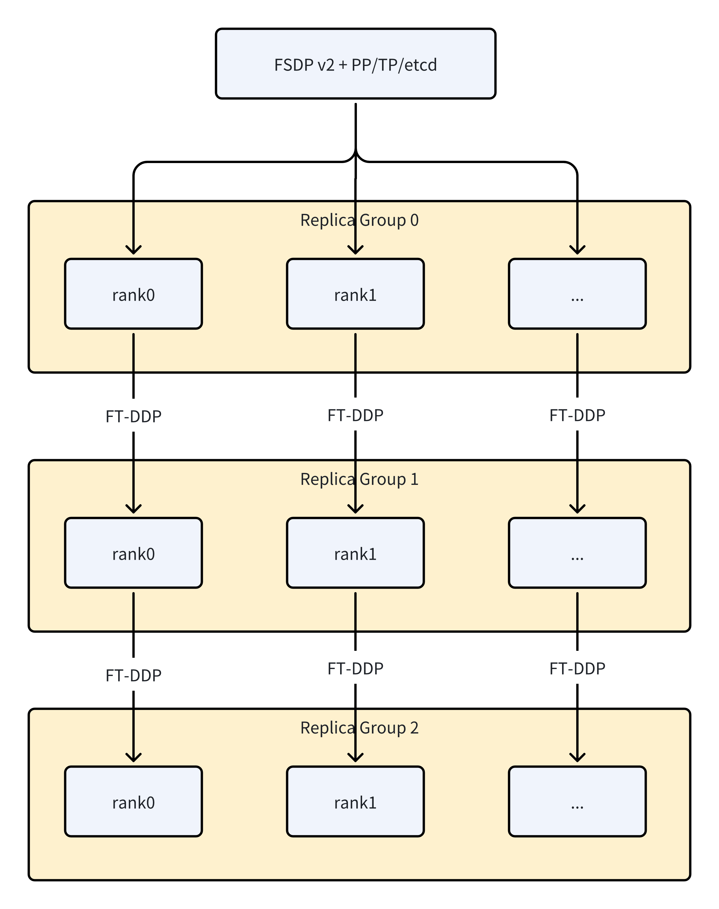

# Resilient Large-Scale Training: Integrating TorchFT with TorchTitan on AMD GPUs

Training large AI models on AMD GPUs demands unwavering stability and robust fault-tolerance capabilities at cluster scale. Yet today's ROCm-based multi-node GPU deployments often rely on brittle checkpoint-and-restart mechanisms to recover from failures. This approach wastes precious compute cycles and slows down training as model sizes and cluster scales grow. To address these challenges, we integrated PyTorch's native fault-tolerance framework—TorchFT—with the TorchTitan training framework on AMD's [Primus-SaFE](https://github.com/AMD-AGI/Primus-SaFE) Kubernetes platform, achieving resilient, checkpoint-less training at hundred-GPU scale.

In this blog, we'll explore the architecture of this integration, walk through the key components and their interactions, and demonstrate how the system dynamically recovers from node failures without halting the entire training job. By the end, you'll understand how TorchFT enables elastic, fault-tolerant distributed training on AMD GPUs and why this represents a significant step toward stable, large-scale AI infrastructure.

## The Challenge: Fault Tolerance at Scale

Training state-of-the-art large language models (LLMs) with billions of parameters requires distributed training across hundreds or thousands of GPUs. At this scale, hardware failures are not exceptional events—they are expected. A single GPU memory error, network partition, or node crash can bring down an entire training run that has been progressing for days or weeks.

Traditional fault-tolerance strategies rely heavily on periodic checkpointing: saving the full model state to persistent storage at regular intervals. When a failure occurs, the entire job restarts from the last checkpoint. While conceptually simple, this approach has significant drawbacks.

| Challenge | Impact |
|-----------|--------|
| Checkpoint overhead | Writing hundreds of gigabytes of model state to storage consumes time and I/O bandwidth |
| Wasted computation | All progress since the last checkpoint is lost upon failure |
| Cluster idle time | The entire cluster sits idle while the failed node is replaced and the job restarts |
| Scalability limits | As cluster size grows, the probability of failure during any checkpoint interval increases |

For truly large-scale training, we need a more dynamic approach—one that allows healthy nodes to continue training while failed nodes recover and rejoin, minimizing wasted computation and maximizing GPU utilization.

## Architecture Overview: Decoupling Parallelism from Fault Tolerance

Our solution decouples the parallelism strategy used within each training replica from the fault-tolerance mechanism used across replicas. This layered design preserves the efficiency of existing parallelization techniques while adding a resilient outer layer for cross-replica coordination.



*Figure 1: The hierarchical architecture combines FSDP2/TP/PP within each replica group with Fault Tolerant DDP across replica groups.*

The architecture operates at two distinct levels. **Within each Replica Group**, standard parallelism strategies are employed. Fully Sharded Data Parallelism (FSDP2) distributes model parameters and optimizer states across GPUs. Tensor Parallelism (TP) splits individual layers across devices for models too large to fit on a single GPU. Pipeline Parallelism (PP) partitions the model into sequential stages for efficient memory utilization. These techniques work together to maximize throughput within a cohesive group of GPUs that share a common fate—if one fails, the group must recover together.

**Across Replica Groups**, TorchFT's Fault Tolerant DDP synchronizes gradients between independent replica groups. Each replica group maintains a complete copy of the model and can continue training independently if other groups fail. When all groups are healthy, they synchronize gradients to ensure consistent model updates. When a group fails, the remaining groups continue training without waiting, and the failed group can rejoin later by synchronizing its state from a healthy peer.

This separation of concerns means that existing, well-optimized parallelism code requires minimal modification. The fault-tolerance layer wraps around the existing training loop rather than requiring invasive changes to the model or optimizer.

## TorchFT Lighthouse: The Central Coordinator

At the heart of the fault-tolerance mechanism is the **TorchFT Lighthouse**—a lightweight coordination service that maintains global consensus across all replica groups. Deployed as a standalone Kubernetes service, the Lighthouse tracks membership and training progress without participating in the actual computation.


*Figure 2: The Lighthouse coordinates multiple replica groups, tracking membership and synchronizing training steps through a quorum mechanism.*

The Lighthouse performs several critical functions. First, it handles **membership management** by continuously tracking which replica groups are active and healthy. When a new group joins or an existing group fails, the Lighthouse updates the cluster's quorum—the set of groups that must agree before committing a training step. Second, it enables **step synchronization** by collecting training step numbers from all active groups and broadcasting the global maximum step. This ensures that recovering groups know exactly where to resume and that all groups maintain consistent progress. Third, it provides **address exchange** by facilitating the discovery of peer addresses so that replica groups can establish direct communication channels for gradient synchronization.

The Lighthouse itself is designed for high availability. It maintains minimal state (primarily the current quorum and step numbers) and can be replicated for redundancy. Its lightweight nature means it introduces negligible overhead to the training process.

### Deploying the Lighthouse on Kubernetes

In our Primus-SaFE platform, the Lighthouse is deployed as a Kubernetes Deployment with an associated Service for stable network access:

```yaml
apiVersion: apps/v1
kind: Deployment
metadata:
  name: lighthouse
  namespace: x-flannel-poc
spec:
  replicas: 1
  selector:
    matchLabels:
      app.kubernetes.io/name: lighthouse
  template:
    metadata:
      labels:
        app.kubernetes.io/name: lighthouse
    spec:
      containers:
      - name: lighthouse
        image: harbor.tw325.primus-safe.amd.com/sync/tasimage/primus:pr-355
        command:
          - "bash"
          - "-c"
          - 'RUST_BACKTRACE=1 torchft_lighthouse --min_replicas 1 
             --quorum_tick_ms 100 --join_timeout_ms 100000'
        resources:
          limits:
            cpu: "2"
            memory: 4Gi
---
apiVersion: v1
kind: Service
metadata:
  name: lighthouse
  namespace: x-flannel-poc
spec:
  ports:
    - port: 29510
      targetPort: 29510
  selector:
    app.kubernetes.io/name: lighthouse
  type: ClusterIP
```

The key configuration parameters include `--min_replicas`, which sets the minimum number of replica groups required to form a quorum, `--quorum_tick_ms`, which controls how frequently the Lighthouse checks for membership changes, and `--join_timeout_ms`, which determines how long new groups have to join before being considered failed.

## Dynamic Fault Recovery Workflow

The true power of this architecture becomes apparent when failures occur. Let us walk through a concrete scenario with two replica groups replicagroup-0 and replicagroup-1 to understand the recovery workflow.

### Normal Training

During normal operation, both replica groups execute the standard training loop: forward pass, backward pass, gradient synchronization via Fault Tolerant all-reduce, and optimizer step. After each step, they report their progress to the Lighthouse and verify that the quorum remains stable.

```
[replicagroup-0] step: 200  loss: 3.5149  memory: 127.42GB(49.78%)  tps: 6,712  tflops: 388.72  mfu: 29.90%
[replicagroup-1] step: 200  loss: 3.5149  memory: 133.36GB(52.10%)  tps: 6,712  tflops: 388.71  mfu: 29.90%
```

Both groups maintain synchronized step counts and similar performance metrics, indicating healthy distributed training.

### Failure Detection and Continued Training

When replicagroup-1 experiences a failure—perhaps due to a GPU error or network partition—the system detects the disruption through failed communication attempts:

```
RuntimeError: [/pytorch/third_party/gloo/gloo/transport/tcp/pair.cc:538] 
Read error [10.32.80.130]:60313: Connection reset by peer
```

Rather than halting, replicagroup-0 detects the quorum change through the Lighthouse and reconfigures its communication group:

```
[replicagroup-0] step 247: reconfiguring for quorum_id=5
[replicagroup-0] Rank 0 is connected to 0 peer ranks. Expected: 0
[replicagroup-0] step 248: should_commit=True enough_replicas=True
[replicagroup-0] step 249: should_commit=True enough_replicas=True
```

The critical insight here is that replicagroup-0 **continues training independently**. It no longer waits for replicagroup-1 to synchronize gradients—instead, it proceeds with its local gradients, maintaining training progress. The `should_commit=True` flag indicates that the optimizer step should be applied, and `enough_replicas=True` confirms that the current quorum (even with just one group) is sufficient to continue.

### Recovery and Rejoin

When the failed node is repaired or replaced, replicagroup-1 restarts and contacts the Lighthouse to learn the current global state:

```
[replicagroup-1] Rank 1 is connected to 1 peer ranks. Expected: 1
[replicagroup-1] Loading the FT checkpoint at step 247
[replicagroup-1] Finished loading the ft checkpoint in 0.56 seconds
[replicagroup-1] Training starts at step 1
```

The recovering group fetches the latest model weights from a healthy peer (replicagroup-0) rather than from persistent storage. This peer-to-peer weight transfer is typically faster than reading from a distributed file system and ensures the recovering group has the most recent state.

Once synchronized, replicagroup-1 rejoins the quorum, and both groups resume coordinated gradient synchronization. The entire recovery process—from failure detection to resumed parallel training—completes without any manual intervention and with minimal impact on overall training throughput.

## Training Configuration and Deployment

To enable fault-tolerant training on the Primus-SaFE platform, each replicagroup is configured with specific environment variables and launch parameters:

```bash
export TORCHFT_LIGHTHOUSE=http://lighthouse:29510

# Launch training with fault tolerance enabled
cd /wekafs/code/Primus && mkdir -p output

bash examples/run_pretrain.sh \
  --training.steps=1000 \
  --fault_tolerance.enable \
  --fault_tolerance.replica_id=0 \
  --fault_tolerance.group_size=2 \
  --training.mock_data=True
```

The key parameters are `--fault_tolerance.enable`, which activates the TorchFT integration, `--fault_tolerance.replica_id`, which assigns a unique identifier to each replica group, and `--fault_tolerance.group_size`, which specifies the total number of replica groups in the training job. The platform handles the orchestration of multiple replicagroups, ensuring each receives the correct replica ID and can discover the Lighthouse service.


## Test Environment

All tests and performance metrics described in this blog were conducted on the Primus-SaFE Kubernetes platform, utilizing a cluster of AMD Instinct™ MI325X GPUs.

**AMD system configuration:**
- Dual AMD EPYC 9575F 64-core processor
- 8× AMD Instinct MI325X GPUs
- 2 NUMA nodes per socket
- Host OS: Ubuntu 22.04.5 LTS with Linux kernel 6.8.0-60-generic
- Host GPU driver: ROCm 6.4 + amdgpu 6.12.12
- VBIOS version: 113-M3250101-100
- AMD ROCm 7.1.0 software
- PyTorch 2.10.0.dev20251112
- TorchTitan 0.2.1
- TorchFT nightly/2025.12.16

## Performance Characteristics

Our testing with the Llama 3 8B model (8,030,261,248 parameters) on AMD MI325X GPUs demonstrated the viability of this approach at scale. The following metrics were observed during stable training.

| Metric | Value |
|--------|-------|
| Model size | 8.03B parameters |
| Memory usage | 127-133 GB (49-52% of available) |
| Throughput | 6,700+ tokens per second |
| TFLOPS | 388-514 |
| MFU (Model FLOPS Utilization) | 29-39% |
| Checkpoint staging time | ~1ms |
| FT checkpoint load time | 0.56 seconds |

The sub-millisecond checkpoint staging time is particularly noteworthy—this represents the overhead of preparing state for potential recovery, which is negligible compared to the actual training computation. The 0.56-second checkpoint load time for recovery demonstrates that rejoining groups can quickly synchronize without significant delay.

## Key Contributions and Future Directions

This integration represents several significant achievements for large-scale training on AMD GPUs.

**First large-scale validation on AMD hardware**: We successfully deployed TorchTitan with TorchFT on AMD GPUs in a Kubernetes environment at hundred-GPU scale, demonstrating that the ROCm software stack fully supports advanced fault-tolerance mechanisms.

**Production-ready deployment on Primus-SaFE**: The integration with AMD's Primus-SaFE platform enables automated and elastic workload management. Users specify the desired number of replica groups, and the platform ensures this number is maintained. When a failure occurs, Primus-SaFE can dynamically preempt lower-priority tasks to acquire the necessary GPU resources, automatically replacing the failed group to restore the job to its full scale. This elastic scaling capability, combined with automated recovery orchestration, provides a truly resilient training environment.

**Exploration of checkpoint-less training**: By enabling healthy nodes to continue training during failures and recovering nodes to synchronize from peers, we have taken a significant step toward truly checkpoint-less training. This approach minimizes wasted computation and maximizes GPU utilization, which becomes increasingly important as cluster sizes grow to thousands or tens of thousands of GPUs.

**Porting to JAX**: A key future direction is to bring these powerful fault-tolerance concepts to other training ecosystems. We are planning to implement the core principles of TorchFT—specifically peer-to-peer state recovery and checkpoint-less training—in JAX. This will involve designing a JAX-native coordination mechanism analogous to the Lighthouse and adapting the dynamic group management to JAX's compiled, functional programming model. The goal is to provide the JAX community with the same level of resilience and elasticity for large-scale training that we have demonstrated in PyTorch.

Looking ahead, we plan to further optimize recovery latency in the PyTorch implementation, explore tighter integration with hardware health monitoring, and validate the approach at even larger scales. The goal is to make fault-tolerant training the default mode of operation for large-scale AI workloads on AMD GPUs, enabling researchers and engineers to focus on model development rather than infrastructure reliability.

## Summary

Training large AI models at scale requires more than raw computational power—it demands resilient infrastructure that can gracefully handle the inevitable hardware failures. By integrating TorchFT with TorchTitan on AMD's Primus-SaFE platform, we have demonstrated a practical approach to fault-tolerant distributed training that minimizes wasted computation and maximizes GPU utilization.

The key architectural insight is the separation of parallelism strategies (FSDP2, TP, PP) within replica groups from fault-tolerance mechanisms (Fault Tolerant DDP) across groups. This layered design preserves the efficiency of existing parallelization techniques while adding elastic recovery capabilities. The TorchFT Lighthouse provides lightweight coordination without becoming a bottleneck, and the peer-to-peer weight synchronization enables rapid recovery without relying on slow persistent storage.

For teams running large-scale training workloads on AMD GPUs, this integration offers a path toward more stable, efficient, and cost-effective model development. As models continue to grow and training runs extend to weeks or months, the ability to survive failures without losing progress becomes not just a convenience but a necessity.

---
## References
- [TorchFT GitHub Repository](https://github.com/pytorch/torchft)
- [TorchTitan Documentation](https://github.com/pytorch/torchtitan)
- [Primus-SaFE Training Platform](https://github.com/AMD-AIG-AIMA/Primus-SaFE)
- [Primus Training Framework](https://github.com/AMD-AIG-AIMA/Primus)
- [ROCm Documentation](https://rocm.docs.amd.com/)
- [PyTorch Distributed Training Guide](https://pytorch.org/tutorials/intermediate/ddp_tutorial.html)

---

*Disclaimer: The performance data and configurations mentioned in this blog are specific to our test environment and may vary under different conditions. Always benchmark with your specific workload and hardware configuration.*