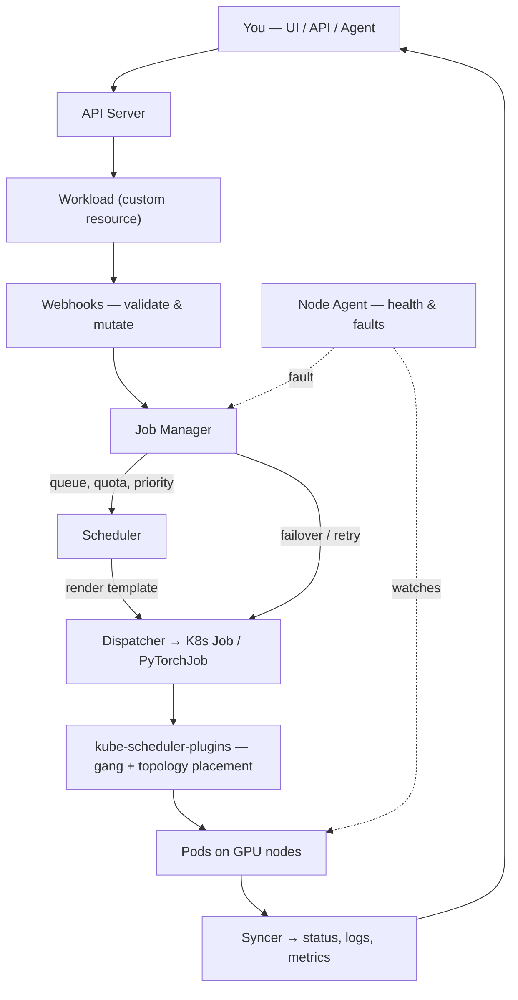

# Architecture

> **Status:** Draft · **Owner:** _unassigned_ · **Source:** root `README.md`, `SaFE/README.md`

Primus-SaFE extends Kubernetes with AI-specific scheduling, fault tolerance, and
multi-tenancy. This page is a high-level map of the components and how a job flows through
them — enough to orient you before the concept pages. You do not need to understand the
internals to use the platform.

## The core services

The Primus-SaFE platform layer comprises five services that run on the control plane:

| Service | Responsibility |
|---------|----------------|
| **API Server** | The single entry point — resource and workload management, authentication and RBAC, and SSH access to pods. |
| **Job Manager** | The full workload lifecycle: queuing, scheduling, priority and preemption, automatic retry and failover, and log indexing. |
| **Resource Manager** | Central management of clusters, nodes, workspaces, storage, and operational jobs. |
| **Webhooks** | Kubernetes admission control — validates and mutates resources as they are created or changed. |
| **Node Agent** | Runs on GPU nodes for continuous health monitoring, fault detection, automatic reporting, and self-healing. |

These run alongside infrastructure provisioned at cluster bring-up — a container registry,
an API gateway, and shared high-throughput storage — together with the web console.

## How a training job flows

In short: you submit a workload; the Job Manager admits and schedules it; the custom
scheduler places the pods with gang semantics and network locality; and the Node Agent
watches for trouble. If a node or GPU fails, the platform reschedules the work and resumes
from your most recent checkpoint.

## Control plane vs. data plane

- **Control plane** — the management services above (API Server, Job Manager, Resource
  Manager, Webhooks), together with the console and database.
- **Data plane** — the GPU clusters where workloads run, each with the Node Agent and the
  required add-ons (GPU operator, CSI storage, training operator, scheduler plugins).

In most deployments the control plane and data plane run on the same cluster, so the
distinction rarely matters in everyday use. At larger scale, a single control plane can
manage many data-plane GPU clusters as a fleet. Both topologies are covered in
[Getting Started → Install](/getting-started/install).

## Modules & what you install

Primus-SaFE consists of several modules that can be adopted independently:

| Module | Role | Requirement |
|--------|------|-------------|
| **Bootstrap** | Provisions a production Kubernetes cluster and its infrastructure | Bare-metal hosts (optional — you may bring your own cluster) |
| **Primus-SaFE** | The platform layer (the five services plus the console) | Any Kubernetes 1.21+ cluster |
| **Primus-Bench** | Node health checks and performance benchmarking | Runs standalone (bare-metal / SLURM / local / Kubernetes) |
| **Scheduler-Plugins** | Custom kube-scheduler (topology-aware, gang) | Installed automatically by Primus-SaFE per cluster |
| **Web** | The browser console | Included in the Primus-SaFE install |

The typical path is: optionally Bootstrap a cluster, install Primus-SaFE, optionally validate
nodes with Primus-Bench, then run jobs. The web console is included in the Primus-SaFE
install.
