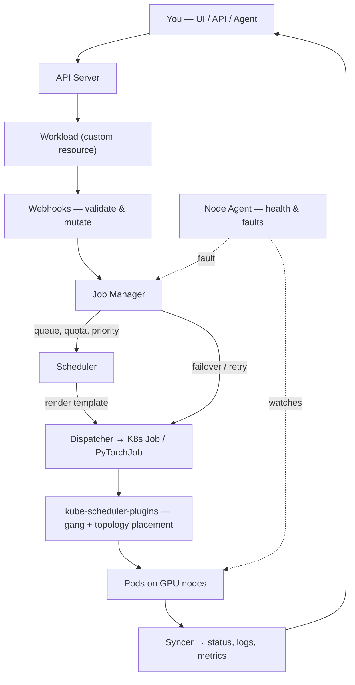

# Architecture

This page is a high-level map of the platform's components and how a job flows through
them — enough to orient you before the concept pages. It is reference/explanation: you do
not need to understand the internals to use the platform, and there is no procedure to run
here.

It is written to serve two audiences at once:

- **For you (the reader):** a plain-language tour of the core services and the path a
  training job takes through them.
- **For an AI agent:** the named services, diagram, and module table below are concrete
  enough to confirm by presence. This is an architecture page, so an agent **verifies**
  that the documented model exists — it does not perform a task.

There is no separate test file and no invisible annotation on this page: the prose you
read is all there is. The only thing kept elsewhere is bookkeeping (priority, and any
known product bug), in the run contract `docs-site/AGENTS.md`.

Primus-SaFE extends Kubernetes with AI-specific scheduling, fault tolerance, and
multi-tenancy.

> **What an agent verifies here:** confirm the documented architecture renders — the
> **core services** table (API Server, Job Manager, Web, Resource Manager, Webhooks, Node
> Agent), the **How a training job flows** mermaid diagram, the **control plane vs. data
> plane** split, and the **Modules & what to install** table are all present. This is
> presence checking only — nothing here is created or mutated.

## The core services

The Primus-SaFE platform layer comprises five services that run on the control plane:

| Service | Responsibility |
|---------|----------------|
| **API Server** | The single entry point — resource and workload management, authentication and RBAC, and SSH access to pods. |
| **Job Manager** | The full workload lifecycle: queuing, scheduling, priority and preemption, automatic retry and failover, and log indexing. |
| **Web** | The web console that users interact with the platform through. |
| **Resource Manager** | Central management of clusters, nodes, workspaces, storage, and operational jobs. |
| **Webhooks** | Kubernetes admission control — validates and mutates resources as they are created or changed. |
| **Node Agent** | Runs on GPU nodes for continuous health monitoring, fault detection, automatic reporting, and self-healing. |

These run alongside infrastructure provisioned at cluster bring-up — a container registry,
an API gateway, and shared high-throughput storage — together with the web console.

## How a training job flows

In short: you submit a workload; the Job Manager admits and schedules it; the custom
scheduler places the pods with gang semantics and network locality; and the Node Agent
watches for trouble. If a node or GPU fails, the platform reschedules the work and resumes
from your most recent checkpoint.

## Control plane vs. data plane

- **Control plane** — the management services above (API Server, Job Manager, Resource
  Manager, Webhooks), together with the console and database.
- **Data plane** — the GPU clusters where workloads run, each with the Node Agent and the
  required add-ons (GPU operator, CSI storage, training operator, scheduler plugins).

In most deployments the control plane and data plane run on the same cluster, so the
distinction rarely matters in everyday use. At larger scale, a single control plane can
manage many data-plane GPU clusters as a fleet. Both topologies are covered in
[Getting Started → Install](/getting-started/install).

## Modules & what to install

Primus-SaFE consists of several modules that can be adopted independently:

| Module | Role | Requirement |
|--------|------|-------------|
| **Bootstrap** | Provisions a production Kubernetes cluster and its infrastructure | Bare-metal hosts, or optionally, you may bring your own Kubernetes cluster |
| **Primus-SaFE** | The platform layer (the five services plus the console) | Any Kubernetes 1.21+ cluster |
| **Primus-Bench** | Node health checks and performance benchmarking | Runs standalone (bare-metal / SLURM / local / Kubernetes) |
| **Scheduler-Plugins** | Custom kube-scheduler (topology-aware, gang) | Installed automatically by Primus-SaFE per cluster |

The typical path is: optionally Bootstrap a cluster, install Primus-SaFE, optionally validate
nodes with Primus-Bench, then run jobs. The web console is included in the Primus-SaFE
install.
