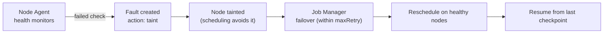

# Fault tolerance & faults

> **Status:** Draft · **Owner:** _unassigned_ · **Source:** `SaFE/docs/apis/fault.md`,
> `SaFE/docs/apis/workload.md`

At scale, the thing that wastes GPU time is rarely the job — it's a failing node, a flaky
link, or a single bad GPU stalling a distributed run. Primus-SaFE protects **goodput** by
detecting these conditions and recovering automatically. This page describes the mechanism;
the value proposition is in the [Overview](/).

## The `Fault` resource

A **`Fault`** is the platform's record of a node problem. It is created automatically, either
from a **Node Agent** report (a failed health check) or from a Kubernetes node-status change.
Each fault carries the node, the reporting monitor, a message, and an **action**:

| Field | Meaning |
|-------|---------|
| `nodeId` | The affected node. |
| `monitorId` | Which Node Agent monitor raised it. |
| `message` | What went wrong (e.g. "network unreachable"). |
| `action` | What the platform did — typically `taint` the node so new work avoids it. |
| `phase` | Fault state. |

Tainting steers scheduling away from the unhealthy node. Resolving (stopping or deleting) a
fault **removes the taint**, returning the node to service.

## Automatic failover & resume

When a node or GPU fails under a running job:

1. The Node Agent detects it and a `Fault` is raised; the node is tainted.
2. The Job Manager **fails over** the workload — it reschedules onto healthy capacity, within
   the workload's `maxRetry` budget.
3. Training **resumes from your most recent checkpoint**, so progress since the last
   checkpoint is the only work lost.

For workloads that need to keep running *through* failures rather than restart, **TorchFT**
runs elastic replica groups: groups can fail and recover independently, and the job continues
as long as the healthy group count stays within its configured min/max. See
[Workload types](/concepts/workload-types).

## Scheduling that prevents stalls

Two scheduler behaviors keep distributed jobs efficient:

- **Gang scheduling** — all pods of a distributed job start together (or not at all), so GPUs
  aren't held idle waiting for stragglers.
- **Topology-aware placement** — pods are placed to respect network locality, reducing
  cross-rack traffic for collective operations.

## How a node failure plays out

> **Not yet covered (capture so we don't lose it):**
> - [ ] **Node operations** — cordon / drain / reboot / export and reboot logs. Decide:
>       here or Operations.
> - [ ] **Node Agent monitor catalog** — the full set of GPU / network / system / disk checks
>       and their self-healing. Link to source rather than enumerating, but note it exists.
