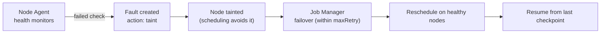

# Fault tolerance & faults

This page explains how Primus-SaFE keeps distributed jobs efficient when hardware misbehaves:
the `Fault` resource, automatic failover and resume, and the scheduler behaviors that prevent
stalls. It is explanation, not a walkthrough — there is no procedure to perform here.

It is written to serve two audiences at once:

- **For you (the reader):** a plain-language account of what happens when a node or GPU fails
  under a running job, and why goodput stays high.
- **For an AI agent:** the named objects, fields, and the failover flow below are concrete enough
  to confirm by presence. As a concept page it is **verify**-level — an agent checks that the
  documented model exists, it does not induce a fault.

There is no separate test file and no invisible annotation on this page: the prose you read is
all there is. The only thing kept elsewhere is bookkeeping (priority, and any known product
bug), in the run contract `docs-site/AGENTS.md`.

At scale, the main cause of low GPU utilization is rarely the job itself. More often a broken
node, a flaky link, or a single bad GPU stalls the entire distributed run. Primus-SaFE achieves
high **goodput** by detecting these conditions and recovering from them automatically.

> **What an agent verifies here:** confirm the documented model exists and the relationships
> hold — the **`Fault`** resource with its fields (`nodeId`, `monitorId`, `message`, `action`,
> `phase`) and the `taint` → failover → resume flow shown below; the **gang scheduling** and
> **topology-aware placement** behaviors; and the link to **TorchFT** for run-through-failure
> jobs. Presence/consistency only — nothing here is created, mutated, or fault-injected.

## The `Fault` resource

A **`Fault`** is the platform's record of a node problem. It is created automatically, either
from a **Node Agent** report (a failed health check) or from a Kubernetes node-status change.
Each fault carries the node, the reporting monitor, a message, and an **action**:

| Field | Meaning |
|-------|---------|
| `nodeId` | The affected node. |
| `monitorId` | Which Node Agent monitor raised it. |
| `message` | What went wrong (e.g. "network unreachable"). |
| `action` | What the platform did — typically `taint` the node so new work avoids it. |
| `phase` | Fault state. |

Tainting steers scheduling away from the unhealthy node. Resolving (stopping or deleting) a
fault **removes the taint**, returning the node to service.

## Automatic failover & resume

When a node or GPU fails under a running job:

1. The Node Agent detects it and a `Fault` is raised; the node is tainted.
2. The Job Manager **fails over** the workload — it reschedules onto healthy capacity, within
   the workload's `maxRetry` budget.
3. Training **resumes from your most recent checkpoint**, so progress since the last
   checkpoint is the only work lost.

For workloads that need to keep running *through* failures rather than restart, **TorchFT**
runs elastic replica groups: groups can fail and recover independently, and the job continues
as long as the healthy group count stays within its configured min/max. See
[Workload types](/concepts/workload-types).

## Scheduling that prevents stalls

Two scheduler behaviors keep distributed jobs efficient:

- **Gang scheduling** — all pods of a distributed job start together (or not at all), so GPUs
  aren't held idle waiting for stragglers.
- **Topology-aware placement** — pods are placed to respect network locality, reducing
  cross-rack traffic for collective operations.

## How a node failure plays out

*Two related areas are covered elsewhere: **node operations** (cordon / drain / reboot, with logs)
in [Manage nodes](/administration/manage-nodes), and the **Node Agent monitor catalog** (the GPU /
network / system / disk health checks and their self-healing) via the node-agent configuration. An
agent confirms these exist rather than exercising them.*
