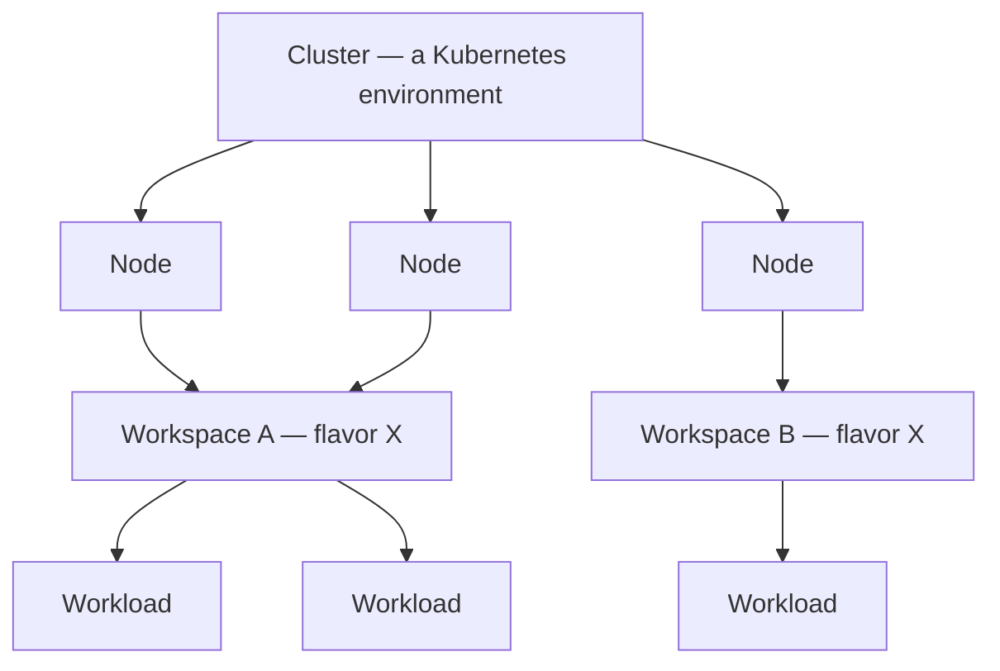

# Workspace

A **workspace** is the multi-tenant slice you actually run work in — an isolated environment
with its own quota, storage, and access control. It sits at the bottom of a small object model:
a **cluster** holds **nodes**, and a workspace draws a set of those nodes as its quota.

<!-- @test
scope: page
mode: verify
priority: P2
targets: [console]
do: open the console as admin and confirm the three object-model pages exist (System > Clusters, System > Nodes, System > Workspaces)
expect:
  - System > Clusters lists at least one cluster with a phase (e.g. Ready)
  - System > Nodes lists nodes, each showing the cluster it belongs to and the workspace it serves
  - System > Workspaces lists workspaces, each bound to a cluster with a node count and a queue policy
-->

## The object model

Three resources form a containment hierarchy; everything you schedule ends up inside it.

| Object | What it is | Lives in / contains |
|--------|------------|---------------------|
| **Cluster** | An independent Kubernetes environment — the top-level container, with its own control-plane and worker nodes and network config. | Contains nodes; hosts workspaces. |
| **Node** | A single machine, registered with a **flavor** (hardware profile), a **template** (add-ons), and an SSH secret. | In exactly one cluster; serves one workspace at a time. |
| **Node flavor** | A hardware profile: the GPU type and per-node CPU/GPU/memory (e.g. 8× `amd.com/gpu` on MI300X). Admins define them. | A workspace pins one flavor; its nodes must match it. |
| **Workspace** | A namespace-isolated tenant of a cluster, with quota, storage, allowed scopes, and access. | In one cluster; holds workloads. |
| **Workload** | A job you submit (`Train`, `Infer`, `Authoring`, `CICD`). | Runs in one workspace. |

In one line: **a cluster owns a pool of nodes; you carve that pool into workspaces (each pinned
to one flavor) by assigning nodes; and every workload runs in a workspace on the nodes it
holds.** So a workspace never spans two clusters, a node serves one workspace at a time, and
growing or shrinking a workspace's quota means moving nodes in or out of it
([Move nodes between workspaces](/administration/manage-nodes#move-nodes-between-workspaces)).

You can see the whole model in the console under **System**. The **Nodes** list makes the
relationships concrete — every node shows the cluster it belongs to and the workspace it serves:

## What a workspace gives you

- **Quota** — a pool of CPU, GPU, memory, and storage your jobs draw from.
- **Isolation** — workloads, secrets, and storage are scoped to the workspace (its Kubernetes
  namespace).
- **Access** — members can use it; managers (workspace-admins) administer it.
- **Scopes** — which kinds of workloads are allowed: `Train`, `Infer`, `Authoring`, `CICD`.

The **Workspaces** list shows each workspace's cluster, its node count (`ready / current /
target`), managers, phase, and queue policy:

## Quota and node flavor

A workspace is bound to **one node flavor**, so its quota is effectively **number of nodes × the
node flavor**:

| Quota field | Meaning |
|-------------|---------|
| `totalQuota` | Total resources in the workspace (nodes × flavor). |
| `usedQuota` | Resources currently consumed by workloads. |
| `availQuota` | What's free (`total − used − abnormal`). |
| `abnormalQuota` | Resources stuck on unhealthy nodes. |

You **pick** a flavor when creating a workspace; **admins define** flavors. One workspace cannot
mix flavors. The system may reserve a small portion of a node's resources to run administrative
tasks, so the schedulable amount is slightly below the raw flavor totals.

## Scheduling within a workspace

- **Queue policy** — `fifo` (strict submission order; a blocked job holds the line) or
  `balance` (any job that fits can run; still honors priority).
- **Preemption** — when `enablePreempt` is on, a higher-priority workload can preempt a
  lower-priority one in the same workspace.
- **Max runtime** — optional per-scope time caps after which the workload is automatically
  terminated (e.g. `Authoring: 168` hours).
- **Idle time** — optional per-scope cap on no-activity time before a workload is terminated.

## Access model (brief)

- **Member** — can use the workspace (submit and manage their own work).
- **Manager (workspace-admin)** — administers the workspace and its resources; granting
  someone manager also grants access.
- A **default** workspace (`isDefault`) is accessible to all users.

Adding teammates and credentials is a task, not a concept — see
[Manage access & quota](/administration/manage-access-and-quota).

## Status

A workspace is `Creating` → `Running`, and can become `Abnormal` (all nodes unavailable) or
`Deleting`. You cannot delete a workspace that still has running workloads.
